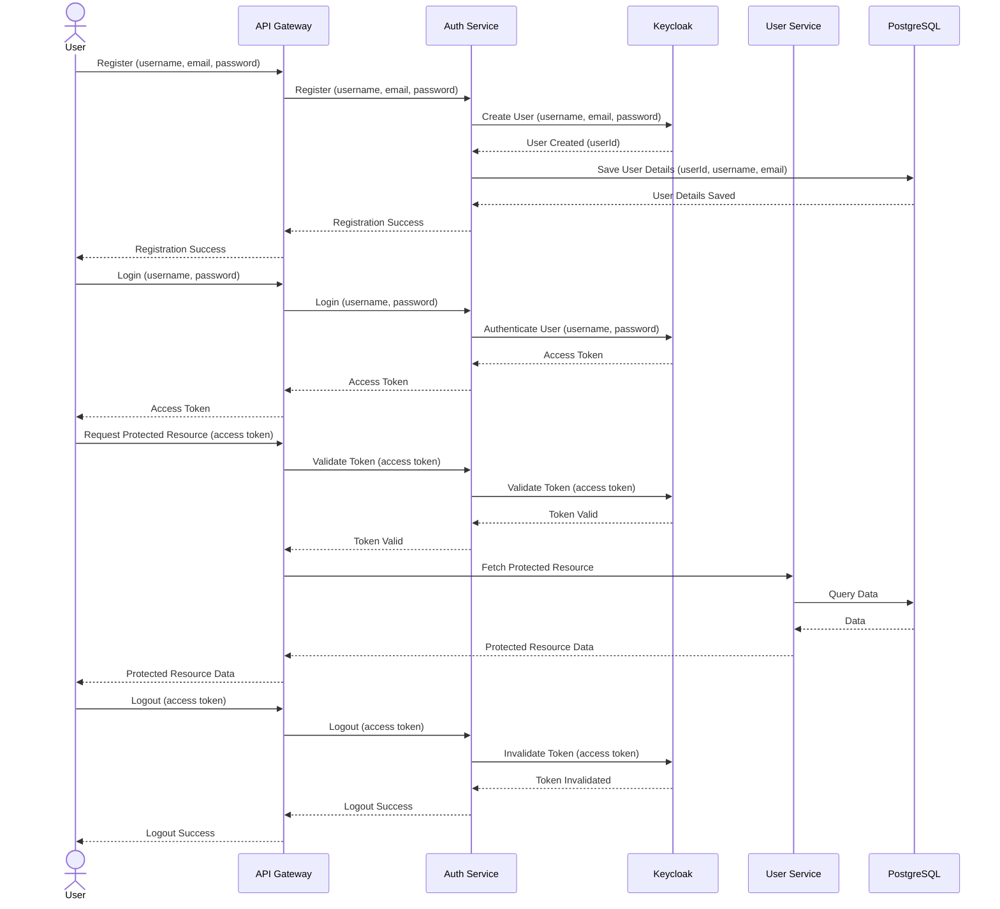
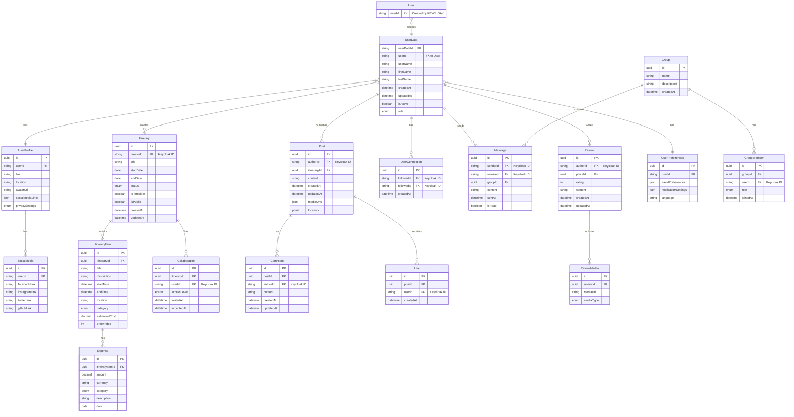
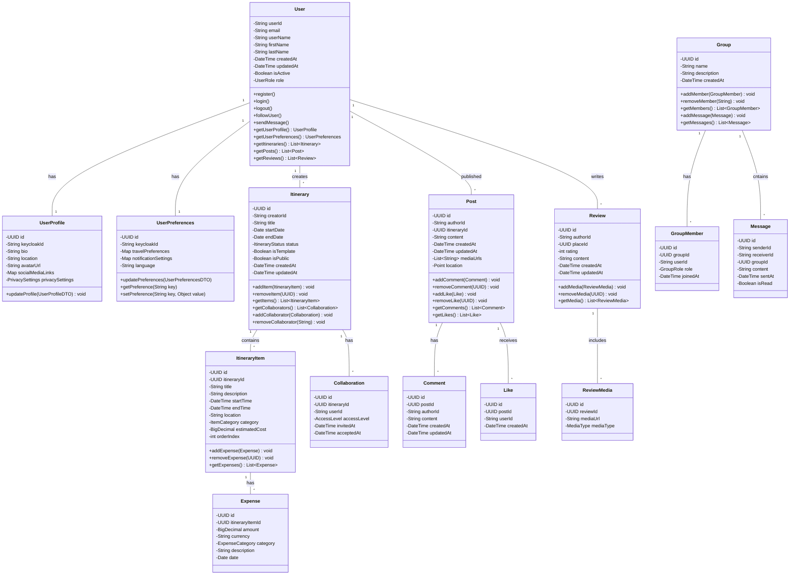
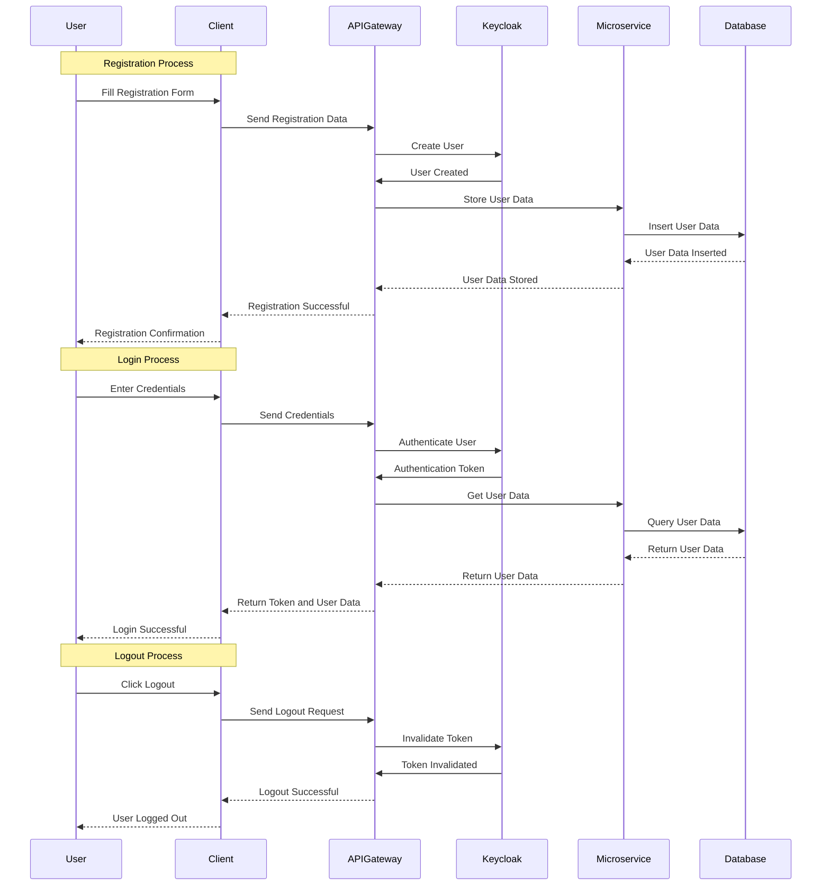

# Travel Platform Backend Engineering Specifications

## 1. Project Overview

The Travel Platform is a comprehensive system that combines travel itinerary planning with social media features. Key functionalities include:
- User will be able to:
  - Register using email and password or social logins (Google, Facebook, GitHub, etc.)
  - Log in securely using JWT-based authentication
  - Recover and reset passwords
  - View and edit profile information
  - Customize privacy settings for their profile
  - Create Itinerary with start date, end date, and trip title
  - Add and organize places to visit, activities, and accommodations
  - Set specific dates and times for each activity
  - Categorize activities (e.g., sightseeing, dining, shopping)
  - Track budget and categorize expenses
  - Save travel plans as templates for future use
  - Share itineraries with other users
  - Search for destinations, activities, dates, and other users
  - Filter search results by categories, ratings, price ranges, etc.
  - Use geolocation-based search for nearby attractions and activities
  - Receive personalized search results based on preferences and past trips
  - Invite friends or other users to collaborate on travel plans
  - Receive instant updates on changes to shared itineraries
  - Set different access levels for collaborators (view, edit, or comment)
  - View version history and track changes in collaborative itineraries
  - Find and follow other travelers with shared interests
  - View an activity feed of connections' activities
  - Post travel stories, photos, and reviews
  - Tag locations and itineraries in posts
  - Like, comment on, and share others' posts
  - Create and share travel vlogs
  - View an interactive travel map of visited locations and shared experiences
  - Send direct messages to other users
  - Create and participate in group chats
  - Use real-time chat for discussing and adjusting travel plans
  - Participate in in-chat polls and decision-making tools for group planning
  - Write and read reviews for visited places
  - Rate destinations on a scale of 1 to 5 stars
  - Sort reviews by date, rating, or relevance
  - Include photos and videos in reviews
  - View travel itineraries on an interactive map
  - Identify and categorize planned destinations and activities
  - View route maps for travel between destinations
  - Book flights, hotels, and activities through third-party integrations
  - Automatically add booking details to itineraries
  - Compare prices for flights, hotels, and activities
  - Upload and share photos from trips
  - Organize photos by trip and itinerary
  - Store and share important travel documents
  - Control access to shared files with privacy settings
  - Receive notifications about itinerary changes, social interactions, and booking confirmations
  - Generate reports summarizing travel activity and history
  - View personalized travel insights and statistics
  - Earn and share travel achievement badges and milestones
  - Earn badges and points for travel experiences and platform engagement
  - Compete on leaderboards with other users
  - Participate in travel challenges and quests during trips
  - Share travel stories and experiences on other social media platforms
  - Access travel-related information (weather forecasts, currency exchange rates, with thuird party apis)
  - Use the platform in multiple languages with localized content
- Moderator will be able to:
  - Review and moderate user posts, reviews, and comments
  - Handle content that violates community guidelines
  - Manage a queue of flagged content
- Admin will be able to:
  - View and manage user accounts
  - Assign different roles to users (regular user, moderator, admin)
  - Implement and manage user bans or restrictions
  - Oversee content moderation activities
  - Manage the platform's content guidelines
  - Handle escalated content issues
  - Access and manage the admin panel
  - Monitor platform usage and user engagement
  - Track key performance indicators (KPIs) for business health
  - Generate custom reports for stakeholders
  - Oversee security measures, including regular audits and penetration testing
  - Oversee internationalization and localization efforts
  - Manage and update the community-curated template library
  - Oversee the implementation of new features and integrations
  - Manage third-party integrations and APIs

The platform is designed to be highly scalable, starting with an initial load of 100,000 users but with the capability to handle significant growth.

## 2. Technology Stack

### Core Backend:
- **Language**: Java 
- **Framework**: Spring Boot
- **Build Tool**: Gradle - Kotlin
- **Client-Server API**: GraphQL (with graphql-java and graphql-java-tools)
- **Service-to-Service Communication**: gRPC (with grpc-spring-boot-starter)
- **Data Serialization**: Protobuf
- **Authentication & Authorization**: Keycloak
- **Real-Time Communication**: Socket.IO
- **Database**: PostgreSQL (primary datastore)
- **ORM**: Spring Data JPA
- **Caching**: Redis
- **Message Queue**: Apache Kafka
- **Search Engine**: Elasticsearch
- **Service Discovery**: Netflix Eureka
- **API Gateway**: Spring Cloud Gateway (with GraphQL support)
- **Circuit Breaker**: Resilience4j
- **Configuration Management**: Spring Cloud Config
- **Istio**: Service Mesh
- **Documentation**: Swagger API
- **Development Environment**: A consistent development environment using Docker Compose

### DevOps & Monitoring:
- **Containerization**: Docker
- **Container Orchestration**: Kubernetes
- **Distributed Tracing**: Zipkin
- **CI/CD**: Jenkins
- **Monitoring**: Prometheus & Grafana
- **Logging**: ELK Stack (Elasticsearch, Logstash, Kibana)
- **Error Tracking**: Sentry

### Additional Tools:
- **Version Control**: Git
- **API Documentation**: GraphQL Playground, gRPC reflection
- **AWS S3**: For storing user-generated content
- **AWS CloudFront**: For faster content delivery
- **Feature Flags**: Togglz
- **API Versioning**: Custom header-based versioning or content negotiation
- **Distributed Transaction Management**: Saga pattern implementation

## 3. ER Diagram

## 4. UML  Diagram

## 5. Services Implementations

Each microservice is implemented as a separate Spring Boot application, adhering to the following principles:

- Single Responsibility: Each service focuses on a specific domain or functionality
- Loose coupling: Each microservice should be independent and communicate with other services through APIs
- Autonomy: Services can be developed, deployed, and scaled independently
- Resilience: Implement circuit breakers and fallback mechanisms
- Data Isolation: Each service manages its own data store
- Data Consistency: Ensure data consistency between Microservices
- Asynchronous Communication: Use Kafka for event-driven interactions between services
- Versioning: For reducing the microservice drift, this results in minimizing the disruption to the existing clients using the services

### Key Services:

- User Service:
   - Integrate KeyCloak
   - Manage user profiles
   - Handle user preferences and settings
   - Handle user-related operations (update profile, change settings, etc)
- Itinerary Service:
   - Create, edit, and manage travel itineraries
   - Handle itinerary items and expenses
   - Handle itinerary sharing and collaboration
   - Integrate with Booking Service for reservations
- Booking Service:
    - Integrates with third-party APIs for flight, hotel, and activity booking
    - Manage booking-related operations and confirmations
- Content Service:
   - Manage user posts and interactions
   - Implement activity feeds
   - Handle user connections(follow/unfollow)
- Reservation Service:
    - Manage booking processes
    - Handle reservation status and updates
- Search Service:
   - Manage advanced search functionality
   - Integrates with Elasticsearch for efficient searching
   - Manage personalized search results
   - Integrate with User and Itinerary services for data
- Recommendation Service:
   - Generate personalized travel recommendations (Without AI or LLMs Or ML)
   - Process user behavior data for improved suggestions
- Notification Service:
   - Handle various types of notifications (email, push, in-app)
   - Manage notification preferences and delivery
- File Services:
    - Manages upload, storage, and retrival of files
    - Integrate with AWS S# for storage
- Analytics Service:
   - Process user behavior data
   - Generate insights and reports
   - Support data-driven decision making
- Reviews and Ratings Service:
   - Handle the review and rating system
- Messaging Service:
    - Manages direct messages and group chats
    - Manage real-time chat functionality
    - Ensure all messages are encrypted for security purposes
- Gamification Service:
    - Manage user achievements and badges
    - Handle point systems and leaderboards
    - Create and manage challenges or quests
- Payment Service:
    - Handle financial transactions securely
    - Integrate with various payment gateways
    - Manage refunds and currency conversions
    - Store and retrieve payment history
- Integration Service:
    - Integrate with third-party travel APIs
    - Manage API credentials and rate limits
    - Handle data transformation between external APIs and internal services
- Geolocation Service:
    - Provide location-based features
    - Calculate distances and proximity
    - Integrate with mapping services
- Curreency Service:
    - Manages currency conversion for multi-currency supports
    - Integrates with external APIs for real-time exchange rates

_Implement service-level rate limiting for more granular control_

