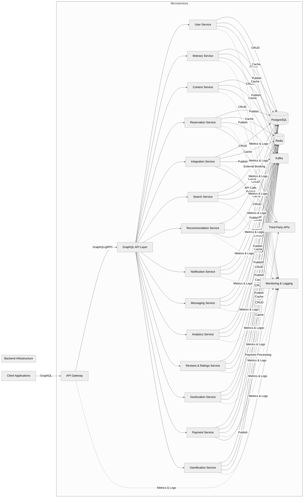

```mermaid
%%{init: {'theme': 'neutral', 'themeVariables': {'fontFamily': 'Arial'}}}%%
graph LR
  Client[Client Applications]
  AG[API Gateway]
  GQL[GraphQL API Layer]
  MS[Microservices]
  DB[(PostgreSQL)]
  Cache[(Redis)]
  MQ[Kafka]
  TP[Third-Party APIs]
  Monitor[Monitoring & Logging]

  Client -->|GraphQL| AG
  AG -->|GraphQL/gRPC| GQL

  subgraph "Microservices"
    GQL --> US[User Service]
    GQL --> IS[Itinerary Service]
    GQL --> CS[Content Service]
    GQL --> RS[Reservation Service]
    GQL --> IN[Integration Service]
    GQL --> SS[Search Service]
    GQL --> RE[Recommendation Service]
    GQL --> NS[Notification Service]
    GQL --> MS[Messaging Service]
    GQL --> AS[Analytics Service]
    GQL --> RR[Reviews & Ratings Service]
    GQL --> GE[Geolocation Service]
    GQL --> PS[Payment Service]
    GQL --> GA[Gamification Service]

    US -->|CRUD| DB
    IS -->|CRUD| DB
    CS -->|CRUD| DB
    RS -->|CRUD| DB
    IN -->|CRUD| DB
    SS -->|CRUD| DB
    RE -->|CRUD| DB
    NS -->|CRUD| DB
    MS -->|CRUD| DB
    AS -->|CRUD| DB
    RR -->|CRUD| DB
    GE -->|CRUD| DB
    PS -->|CRUD| DB
    GA -->|CRUD| DB

    US -->|Cache| Cache
    IS -->|Cache| Cache
    CS -->|Cache| Cache
    RS -->|Cache| Cache
    IN -->|Cache| Cache
    SS -->|Cache| Cache
    RE -->|Cache| Cache
    NS -->|Cache| Cache
    MS -->|Cache| Cache
    AS -->|Cache| Cache
    RR -->|Cache| Cache
    GE -->|Cache| Cache
    PS -->|Cache| Cache
    GA -->|Cache| Cache

    US -->|Publish| MQ
    IS -->|Publish| MQ
    CS -->|Publish| MQ
    RS -->|Publish| MQ
    IN -->|Publish| MQ
    SS -->|Publish| MQ
    RE -->|Publish| MQ
    NS -->|Publish| MQ
    MS -->|Publish| MQ
    AS -->|Publish| MQ
    RR -->|Publish| MQ
    GE -->|Publish| MQ
    PS -->|Publish| MQ
    GA -->|Publish| MQ

    US -.->|Metrics & Logs| Monitor
    IS -.->|Metrics & Logs| Monitor
    CS -.->|Metrics & Logs| Monitor
    RS -.->|Metrics & Logs| Monitor
    IN -.->|Metrics & Logs| Monitor
    SS -.->|Metrics & Logs| Monitor
    RE -.->|Metrics & Logs| Monitor
    NS -.->|Metrics & Logs| Monitor
    MS -.->|Metrics & Logs| Monitor
    AS -.->|Metrics & Logs| Monitor
    RR -.->|Metrics & Logs| Monitor
    GE -.->|Metrics & Logs| Monitor
    PS -.->|Metrics & Logs| Monitor
    GA -.->|Metrics & Logs| Monitor

    RS -->|External Booking| TP
    PS -->|Payment Processing| TP
    IN -->|API Calls| TP

    AG -.->|Metrics & Logs| Monitor
  end

  subgraph "Backend Infrastructure"
    AG
    GQL
    MS
    DB
    Cache
    MQ
    Monitor
  end

```
