# **Travel Itinerary Social Media**

## **Overview**
Aim is to create a comprehensive travel planning platform that combines the functionality of a travel itinerary planner with the engaging features of social media. Users will be able to create, share, and collaborate on travel plans, as well as discover and interact with other travelers, share experiences, and recommend places. Think of it as a one-stop-shop for all your travel planning and sharing needs!

## **Requirements Gathering and Analysis**

### ***User Personas***
1. The Solo Adventurer
2. The Family Planner
3. The Business Traveler
4. The Social Sharer
5. The Budget Backpacker

### ***User Journey Maps***
1. Trip Planning Journey
2. Social Sharing Journey
3. Collaborative Planning Journey

### ***Competitive Analysis***
- Comparison with existing travel planning apps (e.g., TripAdvisor, Roadtrippers)
- Comparison with social media platforms (e.g., Instagram travel communities)
- Unique selling points of our platform

### ***SWOT Analysis***
- Strengths: Integrated social and planning features, user-friendly interface
- Weaknesses: New entrant in a competitive market
- Opportunities: Growing market for travel tech, increasing social media usage
- Threats: Established competitors, changes in travel patterns due to global events

## **Project Management**

### ***Methodology***
- Agile Scrum methodology
- Two-week sprint cycles

### ***Sprint Planning***
- Sprint backlog creation
- Story point estimation
- Capacity planning

### ***Task Breakdown and Estimation***
- Use of Planning Poker for estimation
- Task categorization (Frontend, Backend, DevOps, etc.)

### ***Risk Assessment and Mitigation Strategies***
- Identification of potential risks (e.g., data security, scalability issues)
- Mitigation strategies for each identified risk
- Regular risk review meetings

## **Basic Feature List**

### ***Security***
We take user security seriously. Our platform will include:
- Easy sign-up and login using email-password or social media accounts as per convenience.
- JWT-based authentication for secure API access.
- Password recovery and reset functionality.
- Data Encryption: Ensure end-to-end encryption for sensitive data, especially for messaging and document sharing.
- OWASP Top 10 mitigation strategies implementation
- Regular security audits and penetration testing
- Data privacy compliance (GDPR, CCPA, etc.)

### ***Profile Management***
Users will have full control over their profiles:
- View and edit profile information.
- Add and manage details about past trips and travel experiences.
- Control who can see their profile through customizable privacy settings.
- Profile verification system for increased trust

### ***Role-based Access Control***
To maintain order and ensure smooth operation, we'll have different levels of access:
- Different roles for users, admins, and moderators.
- Admin panel for managing users, roles, and content.
- Regular users will have standard access to the platform's features.
- Administrators will have additional capabilities to manage the platform.
- Moderators will help maintain community standards.
- Granular permission settings for shared itineraries and content

### ***Create and Manage Itineraries***
The core of our platform is the ability to plan trips:
- Create new travel plans by setting a start date, end date, and trip title.
- Add and organize the places you want to visit, things you want to do, and where you'll stay.
- Set specific dates and times for each activity in your itinerary.
- Categorize your activities (e.g., sightseeing, dining, shopping) for better organization.
- Drag-and-drop interface for easy itinerary rearrangement
- Budget tracking and expense categorization

### ***Advanced Search and Filters***
Finding what you're looking for will be easy:
- Search function to look up destinations, activities, dates, and even other users.
- Filter your search results by categories, ratings, price ranges, and more to find exactly what you need.
- Geolocation-based search for nearby attractions and activities
- Personalized search results based on user preferences and past trips

### ***Collaboration***
Planning a trip with friends? We've got you covered:
- Invite friends or other users to work together on your travel plans.
- Get instant updates when changes are made to shared itineraries.
- Set different levels of access for your collaborators (view, edit, or comment).
- Version history and change tracking for collaborative itineraries

### ***Social Media Integration***
Share your adventures across platforms:
- Easily share your travel stories and experiences on other social media sites like Facebook, Instagram, and Twitter.

### ***Booking Integration***
Make your plans a reality without leaving the platform:
- Integration with third-party APIs for booking flights, hotels, and activities.
- Automatically add your booking details to your itinerary for easy reference.
- Price comparison feature for flights, hotels, and activities
- Booking cancellation and modification handling

### ***Itinerary Templates***
Save time on future trips:
- Save your travel plans as templates to reuse for similar trips in the future.
- Share your tried-and-tested itineraries with other users.
- Community-curated template library

### ***User Connections***
Build your travel network:
- Find and follow other travelers who share your interests.
- Keep track of who you're following and who's following you.
- Stay updated with an activity feed showing what your connections are up to.
- Travel buddy matching system based on interests and travel styles

### ***Sharing Experiences***
Tell your travel stories:
- Post about your journeys, including stories, photos, and reviews.
- Tag the locations and itineraries featured in your posts.
- Interact with others by liking, commenting on, and sharing their posts.
- Create and share travel vlogs directly on the platform
- Interactive travel map showing visited locations and shared experiences

### ***Messaging System***
Stay in touch with your travel buddies:
- Send direct messages to other users.
- Create group chats for planning trips or sharing experiences with multiple people.

### ***Place Recommendations***
Discover your next adventure:
- Get personalized suggestions for places to visit based on your preferences and past trips.
- See what destinations and activities are popular among other users.

### ***Reviews and Ratings***
Make informed decisions:
- Write and read reviews for places you've visited or are planning to visit.
- Rate destinations on a scale of 1 to 5 stars.
- Sort through reviews by date, rating, or relevance to find the most helpful information.
- Photo and video integration in reviews for a more comprehensive perspective

### ***Map Visualization***
See your plans come to life:
- View your travel itinerary on an interactive map.
- Easily identify and categorize your planned destinations and activities.
- View route maps for travel between destinations.

### ***Pinned Recommendations***
Explore with confidence:
- Find recommended places highlighted on the map.
- Check out reviews and ratings for these pinned locations.

### ***Real-Time Chat***
Coordinate on the go:
- Use real-time chat to discuss and adjust your travel plans with collaborators.
- Create group chats for planning trips with multiple people.
- Stay on top of your conversations with message notifications and unread message indicators.
- In-chat polls and decision-making tools for group trip planning
- Integration with task management for assigning responsibilities within the group

### ***Notifications***
Never miss an update:
- Receive notifications about changes to your travel plans, social interactions, and booking confirmations.
- Get instant push notifications for important updates, even when you're not actively using the app.

### ***Photo and Document Sharing***
Keep all your travel memories and important info in one place:
- Upload and share photos from your trips.
- Organize your photos by trip and itinerary for easy browsing.
- Safely store and share important travel documents like tickets and booking confirmations.

### ***File Management***
Keep your travel docs organized:
- Easily view, download, and remove shared files.
- Control who can access your shared files with privacy settings.
- Version control for important documents

### ***User Activity Reports***
Track your travels:
- Generate reports summarizing your activity, such as trips planned, places visited, and reviews written.
- Get a visual overview of your travel history and preferences.
- Personalized travel insights and statistics
- Shareable travel achievement badges and milestones

### ***Gamification Elements***
Make travel planning fun:
- Earn badges and points for your travel experiences and platform engagement.
- Compete with other users on leaderboards.
- Participate in travel challenges and quests during your trips.

### ***Trip Analytics***
Gain insights from your travels:
- Analyze data from your trips, such as expenses, travel duration, and types of activities.
- Get summary reports for completed trips to help plan future adventures.

### ***Third-Party Integrations***
Enhance your experience with external services:
- Connect with social media platforms for easy sharing and login.
- Access travel-related information like weather forecasts and currency exchange rates.

### ***Dynamic Pricing Alerts***
Never miss a deal:
- We'll keep an eye on prices for flights, hotels, and activities in your itinerary.
- Set your own price thresholds and get notified when prices drop below them.
- Manage all your price alerts in one convenient dashboard.

### ***Internationalization and Localization***
Cater to a global audience:
- Multi-language support with easy language switching
- Localized content and recommendations
- Cultural consideration in UI/UX design
- Support for different date, time, and currency formats

## **Admin Features**
While these features won't be visible to regular users, they're crucial for maintaining a smooth and safe user experience:

### ***User Management***
Our admin team will be able to:
- View and manage user accounts to ensure platform integrity.
- Assign different roles to users as needed.
- Handle user reports and resolve disputes.
- Implement and manage user bans or restrictions

### ***Content Moderation***
To maintain a positive community:
- Review and moderate user posts, reviews, and comments.
- Handle any content that violates our community guidelines.
- Manage flagged content queue

### ***Analytics Dashboard***
To continually improve our service:
- Monitor how the platform is being used and track user engagement.
- Keep an eye on active users, new sign-ups, and how well we're retaining users.
- Track key performance indicators (KPIs) for business health
- Generate custom reports for stakeholders

## **Tech Stack**

### ***Frontend***
- ReactJS with TypeScript
- React Redux: State management
- React Router: For handling routing
- Tailwind CSS
- React Query: For efficient data fetching and caching
- WebSockets: For real-time communication
- Next.js: For server-side rendering and improved SEO
- Storybook: For component development and testing

### ***Backend***
- Java Spring Boot: Core backend to handle business logic, API endpoints, and primary data processing
- NodeJs: For server-side scripting, handling real-time features (e.g., chat), and additional data processing
- Socket.IO: For real-time communication
- GraphQL with Apollo Server: For more efficient data querying
- Apache Kafka: For event-driven architecture and real-time data streaming
- Security: JWT-based authentication along with OAuth 2.0 and OpenID Connect for more robust authentication and authorization
- Communication Protocols:
  - Client-Server: GraphQL
  - Inter-Service: gRPC

### ***Database***
- PostgreSQL: Primary database for structured data
- MongoDB: Secondary database for unstructured data such as chat messages and photos, etc.
- Elasticsearch: For advanced search capabilities and improved performance
*
### ***Caching***
- Redis: Caching to improve performance and manage sessions

### ***DevOps***
- Docker: Containerization
- Kubernetes: Orchestration
- Prometheus & Grafana: For monitoring, alerting, and visualising system performance
- Jenkins: For continuous integration and continuous deployment (CI/CD)
- Terraform: For infrastructure as code
- SonarQube: For code quality and security analysis
- ELK stack (Elasticsearch, Logstash, Kibana): For centralized logging

### ***Additional Services***
- AWS S3 or Google Cloud Storage: For storing user-generated content
- CDN (e.g., Cloudflare or AWS CloudFront): For faster content delivery

## **Backend Design**

### ***System Architecture Design***
- High-Level system architecture diagram design.
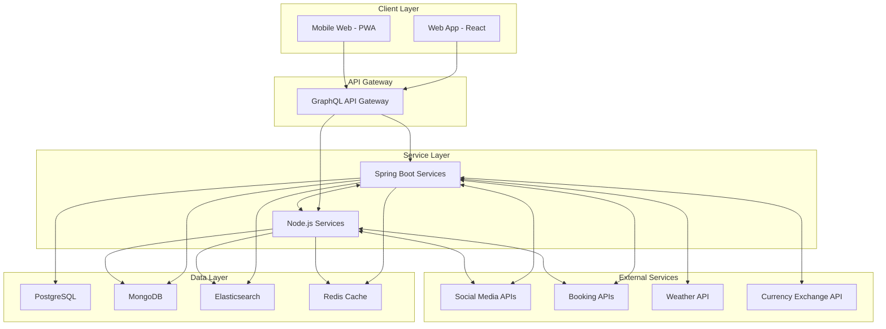
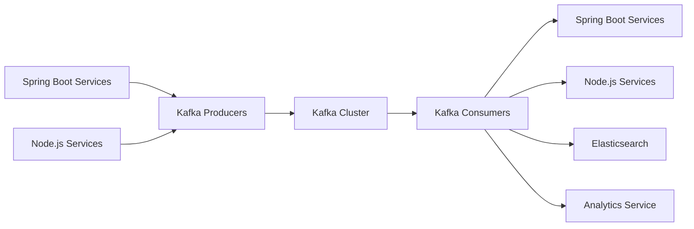
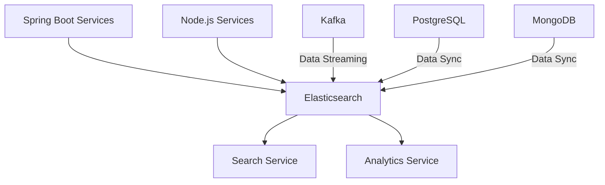
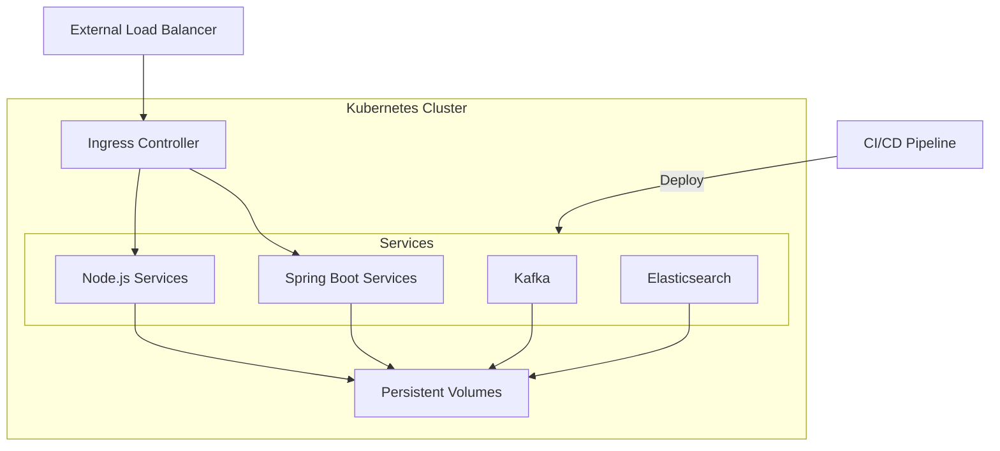
- Service boundaries between Spring Boot and Node.js components design.
    - Spring Boot Services:
        - User Management: Handle user registration, authentication, and profile management.
        - Itinerary Management: Manage creation, editing, and sharing of itineraries.
        - Booking Integration: Handle integration with external booking APIs.
        - Search and Discovery: Manage advanced search functionality and personalized recommendations.
        - Reviews and Ratings: Handle the review and rating system.
    - Node.js Services:
        - Real-time Communication: Manage chat functionality and real-time notifications.
        - Social Features: Handle activity feeds, post creation, and sharing.
        - Dynamic Pricing Alerts: Manage price monitoring and alert notifications.
        - Analytics: Handle user activity tracking and generate reports
```
The service boundaries are defined based on the strengths of each technology:
- Spring Boot is used for core business logic and data-intensive operations.
- Node.js is utilized for real-time features and operations that benefit from its non-blocking I/O.
Both Spring Boot and Node.js services will communicate with each other using gRPC for efficient inter-service communication. They will also both interact with the data layer and external services as needed.
```
- PostgreSQL Schema Design.
```postgresql
-- Users table
CREATE TABLE Users (
UserID SERIAL PRIMARY KEY,
Email VARCHAR(255) UNIQUE NOT NULL,
PasswordHash VARCHAR(255) NOT NULL,
FirstName VARCHAR(50),
LastName VARCHAR(50),
ProfilePictureURL VARCHAR(255),
Bio TEXT,
Role VARCHAR(20) CHECK (Role IN ('User', 'Admin', 'Moderator'))
);
-- UserPreferences table
CREATE TABLE UserPreferences (
PreferenceID SERIAL PRIMARY KEY,
UserID INTEGER REFERENCES Users(UserID),
PreferenceType VARCHAR(50),
PreferenceValue TEXT
);
-- Trips table
CREATE TABLE Trips (
TripID SERIAL PRIMARY KEY,
UserID INTEGER REFERENCES Users(UserID),
Title VARCHAR(255) NOT NULL,
StartDate DATE,
EndDate DATE,
Description TEXT,
PrivacySetting VARCHAR(20)
);
-- TripCollaborators table
CREATE TABLE TripCollaborators (
CollaborationID SERIAL PRIMARY KEY,
TripID INTEGER REFERENCES Trips(TripID),
UserID INTEGER REFERENCES Users(UserID),
PermissionLevel VARCHAR(20)
);
-- Categories table
CREATE TABLE Categories (
CategoryID SERIAL PRIMARY KEY,
Name VARCHAR(50) UNIQUE NOT NULL,
Type VARCHAR(20) CHECK (Type IN ('Destination', 'Activity'))
);
-- Destinations table
CREATE TABLE Destinations (
DestinationID SERIAL PRIMARY KEY,
TripID INTEGER REFERENCES Trips(TripID),
Name VARCHAR(255) NOT NULL,
Latitude DECIMAL(10, 8),
Longitude DECIMAL(11, 8),
CategoryID INTEGER REFERENCES Categories(CategoryID)
);
-- Activities table
CREATE TABLE Activities (
ActivityID SERIAL PRIMARY KEY,
TripID INTEGER REFERENCES Trips(TripID),
DestinationID INTEGER REFERENCES Destinations(DestinationID),
Name VARCHAR(255) NOT NULL,
StartTime TIMESTAMP,
EndTime TIMESTAMP,
Notes TEXT,
CategoryID INTEGER REFERENCES Categories(CategoryID)
);
-- Reviews table
CREATE TABLE Reviews (
ReviewID SERIAL PRIMARY KEY,
UserID INTEGER REFERENCES Users(UserID),
DestinationID INTEGER REFERENCES Destinations(DestinationID),
Rating INTEGER CHECK (Rating BETWEEN 1 AND 5),
Comment TEXT,
Timestamp TIMESTAMP DEFAULT CURRENT_TIMESTAMP
);
-- Followers table
CREATE TABLE Followers (
FollowerID SERIAL PRIMARY KEY,
UserID INTEGER REFERENCES Users(UserID),
FollowedUserID INTEGER REFERENCES Users(UserID),
Timestamp TIMESTAMP DEFAULT CURRENT_TIMESTAMP
);
-- Bookings table
CREATE TABLE Bookings (
BookingID SERIAL PRIMARY KEY,
UserID INTEGER REFERENCES Users(UserID),
TripID INTEGER REFERENCES Trips(TripID),
Type VARCHAR(50),
ConfirmationNumber VARCHAR(100),
BookingDetails JSONB
);
-- UserAchievements table
CREATE TABLE UserAchievements (
AchievementID SERIAL PRIMARY KEY,
UserID INTEGER REFERENCES Users(UserID),
AchievementName VARCHAR(100),
AchievementDescription TEXT,
DateEarned TIMESTAMP DEFAULT CURRENT_TIMESTAMP
);
```
- MongoDB Models Design.
```javascript
//Messages Collection
{
_id: Objectid,
senderld: ObjectId,
receiverld: Objectid,
content: String,
createdAt: Date,
updatedAt: Date,
isRead: Boolean
}
//ChatRooms Collection:
{
_id: Objectid,
name: String,
participants: [ObjectId],
createdAt: Date,
updatedAt: Date,
}
//Notifications Collection
{
_id: Objectid,
userId: Objectid,
type: String,
content: String,
isRead: Boolean,
createdAt: Date,
updatedAt: Date,
}
//Posts Collection:
{
_id: ObjectId,
userld: ObjectId,
content: String,
mediaUrls: [String],
likes: [ObjectId],
comments: [
    {
    userld: ObjectId,
    content: String,
    timestamp: Date
    }
],
createdAt: Date,
updatedAt: Date
}
//TripNotes Collection
{
_id: Objectid,
tripld: ObjectId,
userld: Objectid,
content: String,
createdAt: Date,
updatedAt: Date
}
```
- Elasticsearch integration for search functionality Planning.
    - *Use Cases and Requirements*
        - *Advanced Search:* Allow users to search by destinations, activities, dates, and user profiles.
        - *Filters:* Enable filtering of search results by categories, ratings, price ranges, etc.
    - *Data Indexing Strategy*
        - *Documents:* Define documents for indexing, such as user profiles, itineraries, destinations, activities, posts, and reviews.
        - *Mappings:* Create Elasticsearch mappings to define the structure of these documents.
    - *User Profiles:*
    ```json
    {
      "mappings": {
        "properties": {
          "userId": { "type": "keyword" },
          "firstName": { "type": "text" },
          "lastName": { "type": "text" },
          "bio": { "type": "text" },
          "trips": {
            "type": "nested",
            "properties": {
              "tripId": { "type": "keyword" },
              "title": { "type": "text" },
              "startDate": { "type": "date" },
              "endDate": { "type": "date" }
            }
          }
        }
      }
    }
    ```
    - *Itineraries:*
    ```json
    {
      "mappings": {
        "properties": {
          "tripId": { "type": "keyword" },
          "title": { "type": "text" },
          "startDate": { "type": "date" },
          "endDate": { "type": "date" },
          "destinations": {
            "type": "nested",
            "properties": {
              "destinationId": { "type": "keyword" },
              "name": { "type": "text" },
              "latitude": { "type": "float" },
              "longitude": { "type": "float" }
            }
          },
          "activities": {
            "type": "nested",
            "properties": {
              "activityId": { "type": "keyword" },
              "name": { "type": "text" },
              "startTime": { "type": "date" },
              "endTime": { "type": "date" }
            }
          }
        }
      }
    }
    ```
  - *Search Implementation*
    - Develop a search service that interfaces with Elasticsearch.
    - Implement full-text search across all indexed entities.
    - Use multi-match queries for searching across multiple fields:
    ```json
    {
      "multi_match": {
        "query": "beach vacation",
        "fields": ["title", "description", "tags"]
      }
    }
    ```
    - Implement geo-spatial queries for location-based searches:
    ```json
    {
      "geo_distance": {
        "distance": "100km",
        "location": {
          "lat": 40.7128,
          "lon": -74.0060
        }
      }
    }
    ```
    - Use date range queries for trip searches:
    ```json
    {
      "range": {
        "startDate": {
          "gte": "2023-07-01",
          "lte": "2023-08-31"
        }
      }
    }
    ```

  - *Advanced Features*
    - Implement faceted search using aggregations:
    ```json
    {
      "aggs": {
        "popular_tags": {
          "terms": { "field": "tags" }
        }
      }
    }
    ```
    - Use fuzzy matching for typo tolerance:
    ```json
    {
      "match": {
        "title": {
          "query": "beech",
          "fuzziness": "AUTO"
        }
      }
    }
    ```
    - Implement autocomplete functionality using edge ngram tokenizer
    - Use highlighting to show matched terms in search results
  - *Data Ingestion Process*
        - *Real-Time Data Sync:* Use Kafka for real-time data streaming from PostgreSQL and MongoDB to Elasticsearch.
        - *Batch Data Processing:* Implement periodic batch jobs to sync data from the main databases to Elasticsearch.
    - *Search API*
        - *Elasticsearch Query:* Design Elasticsearch queries to support complex search and filter operations.
        - *GraphQL Integration:* Create GraphQL resolvers to interact with Elasticsearch and fetch search results.
    - *Performance Optimization*
        - *Indexing Strategy:* Optimize indexing settings (e.g., number of shards and replicas) based on the expected data volume.
        - *Search Tuning:* Use analyzers, tokenizers, and custom scoring algorithms to enhance search accuracy and performance.
    - *Security and Access Control*
        - *Authentication:* Use JWT for secure access to the search API.
        - *Authorization:* Implement role-based access control to restrict access to certain search functionalities.
- Caching strategy with Redis Planning.
  - *Use Cases and Requirements*
    -  Cache-Aside (Lazy Loading)
      -  Implement for frequently accessed, relatively static data (e.g., user profiles, trip details)
  - Write-Through
    - Use for data that needs to be immediately consistent (e.g., user settings, trip collaborators)
  - Time-based Expiration
    - Implement for data that can tolerate some staleness (e.g., popular destinations, trending activities)
    - Set appropriate TTL (Time To Live) based on data volatility
  - Session Management
    - Store session data in Redis for fast access and easy distribution across servers
    - Use Redis' built-in expiration for automatic session cleanup.
  - Rate Limiting
    - Implement rate limiting using Redis' incrementing counters with expiration
  - Leaderboards
    - Use Redis Sorted Sets for efficient leaderboard implementation
  - Distributed Locking
    - Implement distributed locks for managing concurrent access to shared resources
    - Use Redis' atomic operations to ensure lock integrity
  - Eviction Policies
    - Configure appropriate eviction policies based on use case:
      - volatile-lru: Evict least recently used keys with expiration set
      - allkeys-lru: Evict least recently used keys
      - volatile-ttl: Evict keys with shortest time to live
    - *Session Management:* Store user session data to ensure quick retrieval and manage user sessions.
    - *Data Caching:* Cache frequently accessed data to reduce database load and improve response times.
    - *Real-Time Messaging:* Use Redis for real-time messaging and notifications.
  - *Data Caching*
    - *Cache Strategy:* Identify frequently accessed data such as user profiles, itineraries, and search results.
    - *Cache Keys:* Design cache keys to ensure efficient data retrieval.
    - *Example Cache Key:* `userProfile:{userId}`, `itinerary:{tripId}`
    - *Spring Cache Integration:** Use Spring Cache with Redis to manage caching in Spring Boot.
  ```java
  @Cacheable(value = "userProfiles", key = "#userId")
  public UserProfile getUserProfile(String userId) {
    // Method implementation
  }
  ```
  - *Real-Time Messaging*
    - *Publish-Subscribe Model:* Use Redis Pub/Sub for real-time message broadcasting.
    - *Example Channels:* `notifications:{userId}`, `chatRoom:{roomId}`
    - *Redis Integration in Node.js:* Use the `redis` package in Node.js to implement Pub/Sub functionality.
  ```javascript
  const redis = require('redis');
  const subscriber = redis.createClient();
  const publisher = redis.createClient();

  subscriber.subscribe('notifications:user123');

  subscriber.on('message', (channel, message) => {
    console.log(`Received message: ${message} from channel: ${channel}`);
  });

  publisher.publish('notifications:user123', 'New notification message');
  ```
  - *Performance Optimization*
    - *TTL Settings:* Set appropriate TTL for cached data to ensure stale data is evicted.
    - *Eviction Policies:* Use Redis eviction policies (e.g., LRU, LFU) to manage cache size and evict least-used data.
  - *Monitoring and Management*
    - *Redis Monitoring:* Use tools like RedisInsight to monitor Redis performance and manage data.
    - *Cache Metrics:** Integrate with Prometheus and Grafana to visualize cache performance metrics.
  - *Security and Access Control*
    - *Secure Connection:* Use SSL/TLS for secure communication with the Redis server.
    - *Authentication:* Use Redis AUTH to secure access to the Redis instance.

### ***Data Flow and Diagrams***

- Detailed Data Flow Diagrams
  - User Registration and Authentication Flow
    ```mermaid
    sequenceDiagram
        participant User
        participant Frontend
        participant AuthService
        participant UserDB
        participant EmailService
    
        User->>Frontend: Enter registration details
        Frontend->>AuthService: Send registration request
        AuthService->>UserDB: Check if user exists
        UserDB-->>AuthService: User doesn't exist
        AuthService->>UserDB: Create new user
        AuthService->>EmailService: Send verification email
        EmailService-->>User: Receive verification email
        User->>Frontend: Click verification link
        Frontend->>AuthService: Verify email
        AuthService->>UserDB: Update user status
        AuthService-->>Frontend: Confirmation
        Frontend-->>User: Display success message
    ```
  - Itinerary Creation and Sharing Flow
    ```mermaid
    sequenceDiagram
        participant User
        participant Frontend
        participant ItineraryService
        participant UserService
        participant NotificationService
        participant ItineraryDB
    
        User->>Frontend: Create new itinerary
        Frontend->>ItineraryService: Send itinerary data
        ItineraryService->>ItineraryDB: Save itinerary
        ItineraryDB-->>ItineraryService: Confirm save
        User->>Frontend: Share itinerary
        Frontend->>ItineraryService: Request share
        ItineraryService->>UserService: Get user contacts
        UserService-->>ItineraryService: Return contacts
        ItineraryService->>NotificationService: Send share notifications
        NotificationService-->>User: Notify shared users
        ItineraryService-->>Frontend: Confirm share
        Frontend-->>User: Display success message
    ```    
  - Social Interaction and Messaging Flow
    ```mermaid
    sequenceDiagram
        participant User1
        participant User2
        participant Frontend
        participant ChatService
        participant NotificationService
        participant MessageDB
    
        User1->>Frontend: Send message
        Frontend->>ChatService: Transmit message
        ChatService->>MessageDB: Store message
        ChatService->>NotificationService: Trigger notification
        NotificationService-->>User2: Receive notification
        User2->>Frontend: Open chat
        Frontend->>ChatService: Request chat history
        ChatService->>MessageDB: Fetch messages
        MessageDB-->>ChatService: Return messages
        ChatService-->>Frontend: Send chat history
        Frontend-->>User2: Display chat
    ```
  - Booking and Reservation Flow
    ```mermaid
    sequenceDiagram
        participant User
        participant Frontend
        participant BookingService
        participant PaymentService
        participant ExternalBookingAPI
        participant ItineraryService
        participant BookingDB
    
        User->>Frontend: Select booking option
        Frontend->>BookingService: Send booking request
        BookingService->>ExternalBookingAPI: Check availability
        ExternalBookingAPI-->>BookingService: Confirm availability
        BookingService-->>Frontend: Show booking details
        User->>Frontend: Confirm booking
        Frontend->>PaymentService: Process payment
        PaymentService-->>Frontend: Payment confirmed
        Frontend->>BookingService: Complete booking
        BookingService->>ExternalBookingAPI: Finalize reservation
        BookingService->>BookingDB: Store booking details
        BookingService->>ItineraryService: Update itinerary
        BookingService-->>Frontend: Booking confirmation
        Frontend-->>User: Display confirmation
    ```
  - Search and Recommendation Flow
    ```mermaid
    graph TD
        A[User] -->|Enter search query| B[Frontend]
        B -->|Send search request| C[SearchService]
        C -->|Query| D[Elasticsearch]
        D -->|Return results| C
        C -->|Get user preferences| E[UserService]
        E -->|Return preferences| C
        C -->|Apply personalization| F[RecommendationEngine]
        F -->|Return recommendations| C
        C -->|Send results| B
        B -->|Display results| A
    ```
- Sequence Diagrams for Key Processes
  - User Login Process
    ```mermaid
    sequenceDiagram
        participant User
        participant Frontend
        participant AuthService
        participant Database
        User->>Frontend: Enter credentials
        Frontend->>AuthService: Send login request
        AuthService->>Database: Verify credentials
        Database-->>AuthService: Return user data
        AuthService->>AuthService: Generate JWT
        AuthService-->>Frontend: Return JWT
        Frontend->>Frontend: Store JWT
        Frontend-->>User: Display logged in state
    ```
  - Collaborative Itinerary Editing
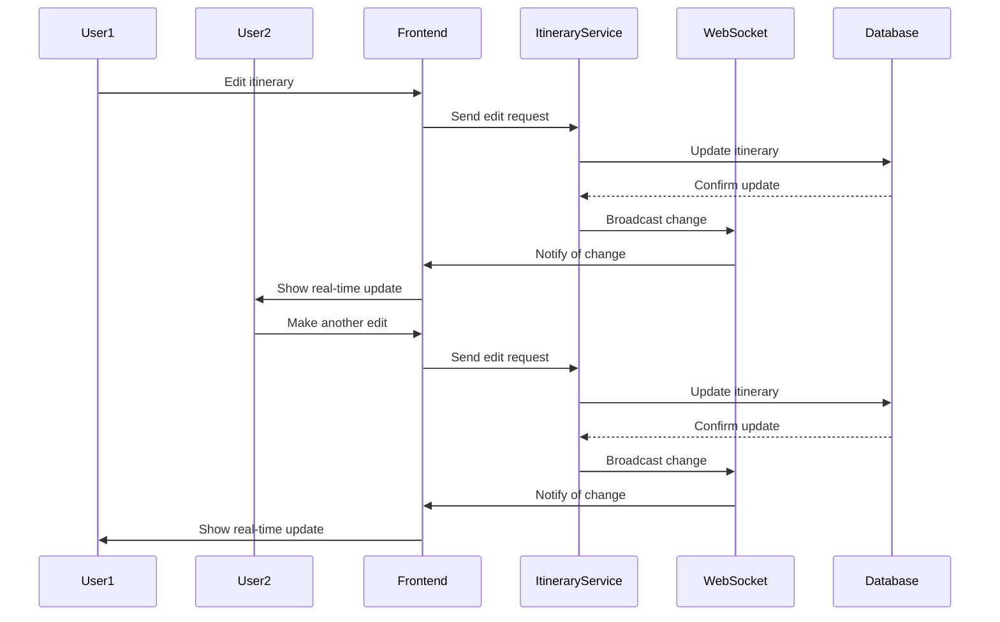
- Real-time Chat Messaging
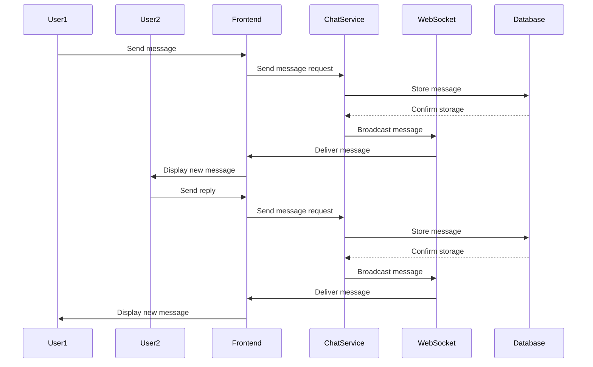
  - Booking Integration Process
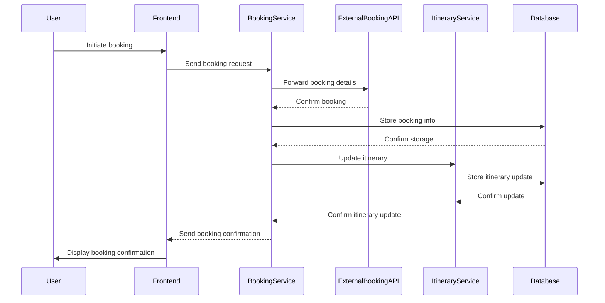
  - Content Moderation Workflow
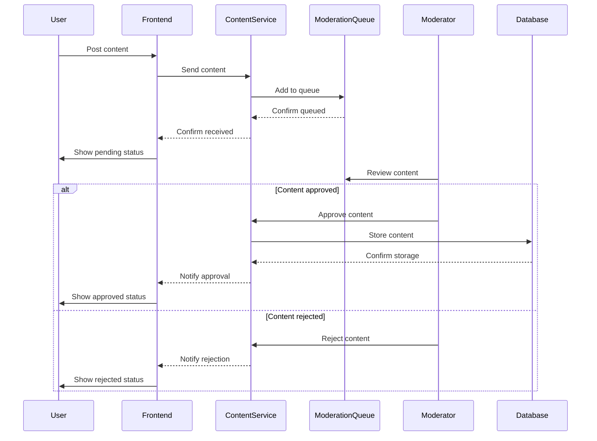
- Component Interaction Diagrams
 - Frontend-Backend Interaction
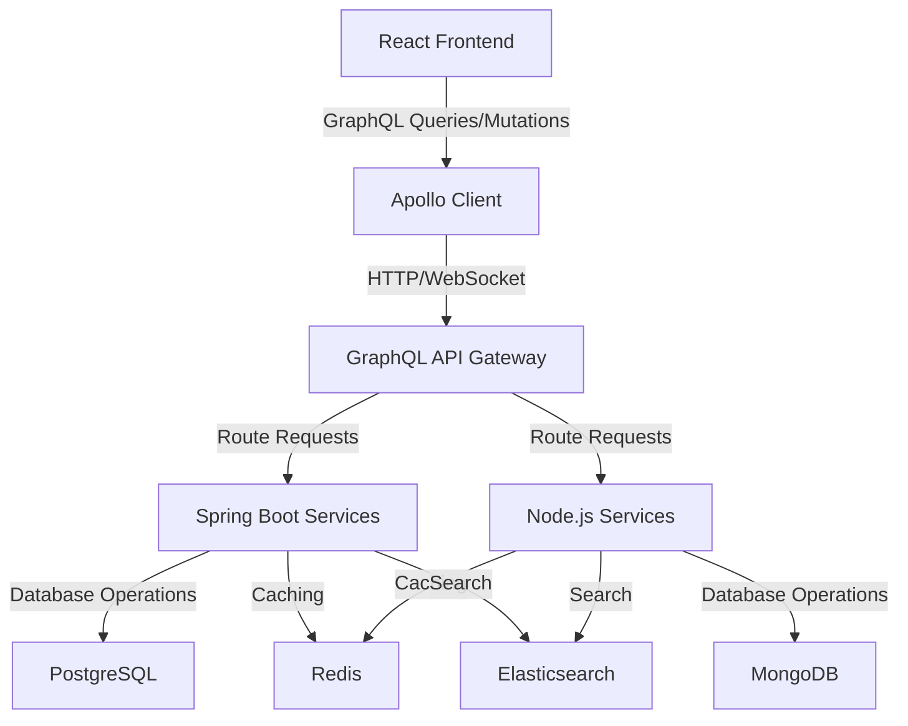
  - Microservices Communication
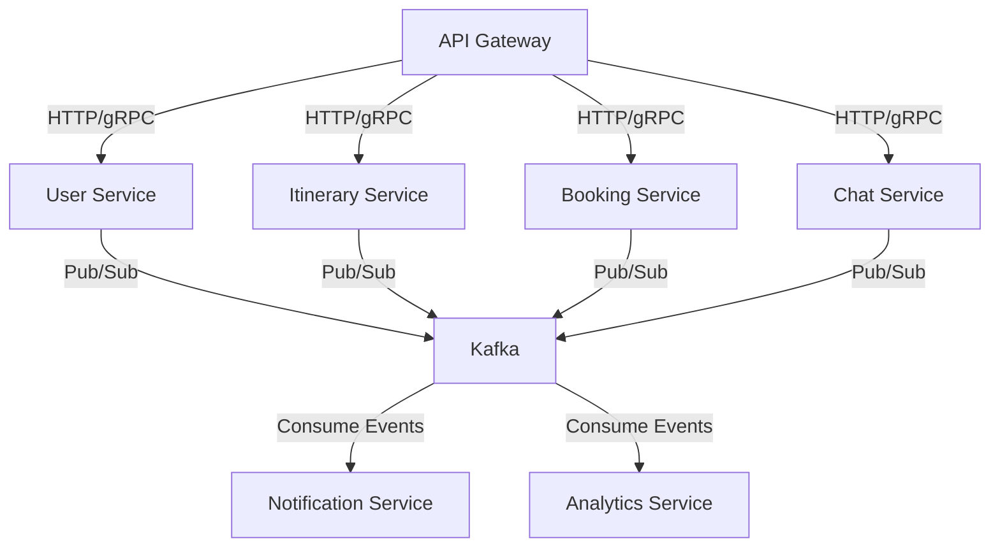
 - Data Storage and Retrieval Flows
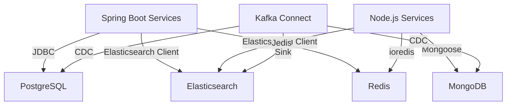
 - External API Integration Flows
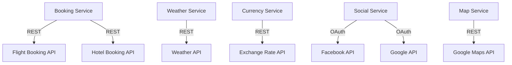

### ***API Design***
- Design GraphQL schema for client-server communication.
```graphql
# Types
type User {
  id: ID!
  email: String!
  firstName: String
  lastName: String
  profilePictureUrl: String
  bio: String
  role: UserRole!
  trips: [Trip!]
  reviews: [Review!]
  followers: [User!]
  following: [User!]
}

enum UserRole {
  USER
  ADMIN
  MODERATOR
}

type Trip {
  id: ID!
  title: String!
  startDate: Date
  endDate: Date
  description: String
  privacySetting: PrivacySetting!
  creator: User!
  collaborators: [User!]
  destinations: [Destination!]
  activities: [Activity!]
}

enum PrivacySetting {
  PUBLIC
  PRIVATE
  FRIENDS_ONLY
}

type Destination {
  id: ID!
  name: String!
  latitude: Float
  longitude: Float
  category: Category
}

type Activity {
  id: ID!
  name: String!
  startTime: DateTime
  endTime: DateTime
  notes: String
  category: Category
}

type Category {
  id: ID!
  name: String!
  type: CategoryType!
}

enum CategoryType {
  DESTINATION
  ACTIVITY
}

type Review {
  id: ID!
  user: User!
  destination: Destination!
  rating: Int!
  comment: String
  timestamp: DateTime!
}

# Queries
type Query {
  user(id: ID!): User
  trip(id: ID!): Trip
  searchTrips(query: String!, filters: TripFilters): [Trip!]
  searchDestinations(query: String!, filters: DestinationFilters): [Destination!]
}

input TripFilters {
  startDate: Date
  endDate: Date
  category: ID
}

input DestinationFilters {
  category: ID
  rating: Int
}

# Mutations
type Mutation {
  createUser(input: CreateUserInput!): User!
  updateUser(id: ID!, input: UpdateUserInput!): User!
  createTrip(input: CreateTripInput!): Trip!
  updateTrip(id: ID!, input: UpdateTripInput!): Trip!
  addActivityToTrip(tripId: ID!, input: CreateActivityInput!): Activity!
  createReview(input: CreateReviewInput!): Review!
  followUser(userId: ID!): User!
  unfollowUser(userId: ID!): User!
}

input CreateUserInput {
  email: String!
  password: String!
  firstName: String
  lastName: String
}

input UpdateUserInput {
  firstName: String
  lastName: String
  profilePictureUrl: String
  bio: String
}

input CreateTripInput {
  title: String!
  startDate: Date
  endDate: Date
  description: String
  privacySetting: PrivacySetting!
}

input UpdateTripInput {
  title: String
  startDate: Date
  endDate: Date
  description: String
  privacySetting: PrivacySetting
}

input CreateActivityInput {
  name: String!
  startTime: DateTime
  endTime: DateTime
  notes: String
  categoryId: ID
}

input CreateReviewInput {
  destinationId: ID!
  rating: Int!
  comment: String
}

# Subscriptions
type Subscription {
  tripUpdated(id: ID!): Trip!
  newMessage(chatId: ID!): Message!
}

type Message {
  id: ID!
  sender: User!
  content: String!
  timestamp: DateTime!
}
```
- Define gRPC service definitions for inter-service communication.
```txt
syntax = "proto3";

package travelapp;

service UserService {
  rpc GetUser(GetUserRequest) returns (User);
  rpc CreateUser(CreateUserRequest) returns (User);
  rpc UpdateUser(UpdateUserRequest) returns (User);
  rpc FollowUser(FollowUserRequest) returns (FollowUserResponse);
  rpc UnfollowUser(UnfollowUserRequest) returns (UnfollowUserResponse);
}

service TripService {
  rpc GetTrip(GetTripRequest) returns (Trip);
  rpc CreateTrip(CreateTripRequest) returns (Trip);
  rpc UpdateTrip(UpdateTripRequest) returns (Trip);
  rpc AddActivityToTrip(AddActivityRequest) returns (Activity);
}

service SearchService {
  rpc SearchTrips(SearchTripsRequest) returns (SearchTripsResponse);
  rpc SearchDestinations(SearchDestinationsRequest) returns (SearchDestinationsResponse);
}

service ReviewService {
  rpc CreateReview(CreateReviewRequest) returns (Review);
  rpc GetReviewsForDestination(GetReviewsRequest) returns (GetReviewsResponse);
}

message User {
  string id = 1;
  string email = 2;
  string first_name = 3;
  string last_name = 4;
  string profile_picture_url = 5;
  string bio = 6;
  UserRole role = 7;
}

enum UserRole {
  USER = 0;
  ADMIN = 1;
  MODERATOR = 2;
}

message Trip {
  string id = 1;
  string title = 2;
  string start_date = 3;
  string end_date = 4;
  string description = 5;
  PrivacySetting privacy_setting = 6;
  string creator_id = 7;
  repeated string collaborator_ids = 8;
}

enum PrivacySetting {
  PUBLIC = 0;
  PRIVATE = 1;
  FRIENDS_ONLY = 2;
}

message Activity {
  string id = 1;
  string name = 2;
  string start_time = 3;
  string end_time = 4;
  string notes = 5;
  string category_id = 6;
}

message Review {
  string id = 1;
  string user_id = 2;
  string destination_id = 3;
  int32 rating = 4;
  string comment = 5;
  string timestamp = 6;
}

// Request and response messages for each RPC call would be defined here
```
- Plan RESTful APIs for external integrations.
  - Booking System Integration
    - Flight Bookings
      - `GET /api/flights/search`: Search for flights
      - `POST /api/flights/book`: Book a flight
      - `GET /api/flights/{bookingId}`: Get flight booking details
    - Hotel Bookings
      - `GET /api/hotels/search`: Search for hotels
      - `POST /api/hotels/book`: Book a hotel
      - `GET /api/hotels/{bookingId}`: Get hotel booking details
    - Activity Bookings
      - `GET /api/activities/search`: Search for bookable activities
      - `POST /api/activities/book`: Book an activity
      - `GET /api/activities/{bookingId}`: Get activity booking details
  - Weather Service Integration
      - GET /api/weather/current`: Get current weather for a location
      - `GET /api/weather/forecast`: Get weather forecast for a location
  - Social Media Integration
    - Facebook : `POST /api/social/facebook/share`: Share a trip or post to Facebook
    - Instagram : `POST /api/social/instagram/share`: Share a photo to Instagram
    - Twitter : `POST /api/social/twitter/tweet`: Post a tweet about a trip or activity
  - General
    - All endpoints should accept and return JSON
    - Use standard HTTP status codes (200 for success, 400 for bad request, 401 for unauthorized, etc.)
    - Implement rate limiting and authentication for all endpoints
    - Use HTTPS for all communications

### ***Security Architecture***
- Design authentication and authorization system.
  - JWT-based authentication for stateless authentication
  - OAuth 2.0 and OpenID Connect for third-party authentication
  - Role-based access control (RBAC) for authorization
  - Multi-factor authentication (MFA) for enhanced security
- Plan data encryption strategies.
  - Use of HTTPS/TLS for all client-server communications
  - Encryption at rest for sensitive data in databases
  - End-to-end encryption for chat messages
  - Encryption of sensitive files and documents

### ***Testing Strategy***

- Unit Testing Approach
  - Use of JUnit for Java and Jest for JavaScript unit tests
  - Aim for high test coverage (e.g., 80% or higher)
  - Implementation of test-driven development (TDD) practices
- Integration Testing Plan
  - Use of Spring Boot Test for testing Spring components
  - Integration tests for database operations and external service integrations
  - API integration tests using tools like Postman or REST Assured
- End-to-End Testing Strategy
  - Use of Selenium or Cypress for automated UI testing
  - Creation of critical user journey test scenarios
  - Regular execution of E2E tests in staging environment
- Performance Testing Benchmarks
  - Load testing using tools like Apache JMeter or Gatling
  - Stress testing to determine system breaking points
  - Establish performance SLAs (e.g., response times, throughput)
- Security Testing Procedures
  - Regular vulnerability scans using tools like OWASP ZAP
  - Penetration testing conducted by internal team and external security firms
  - Code security analysis using SonarQube and other static analysis tools

### ***Deployment and DevOps***

- CI/CD Pipeline Description
  - Code commit triggers pipeline in Jenkins
  - Run unit and integration tests
  - Static code analysis with SonarQube
  - Build Docker images
  - Push images to container registry
  - Deploy to staging environment
  - Run automated UI and API tests
  - Manual QA and approval
  - Deploy to production
- Environment Setup
  - Development: Local development environments with Docker Compose
  - Staging: Kubernetes cluster mimicking production setup
  - Production: Multi-zone Kubernetes cluster on cloud provider
- Rollback Strategies
  - Use of Kubernetes rolling updates for zero-downtime deployments
  - Automated rollback triggers based on health checks and error rates
  - Maintenance of multiple versions of backend services for quick rollbacks
-Blue-Green Deployment Considerations
  - Implementation of blue-green deployments for critical services
  - Use of traffic shifting for gradual rollouts
  - Automated smoke tests post-deployment

### ***Scalability and Performance***

- Load Balancing Strategies
  - Use of Kubernetes Ingress for HTTP load balancing
  - Implementation of service mesh (e.g., Istio) for advanced traffic management
  - Database read replicas for distributing read traffic
- Database Sharding Approach
  - Horizontal sharding of PostgreSQL based on user ID or geographic region
  - Use of MongoDB's native sharding capabilities for unstructured data
- Caching Strategies
  - Multi-layer caching approach:
    - Browser caching for static assets
    - CDN caching for globally distributed content
    - Application-level caching using Redis
    - Database query result caching
- Asynchronous Processing for Heavy Tasks
  - Use of Kafka for event-driven architecture and task queuing
  - Implementation of background job processors for heavy computational tasks
  - Asynchronous processing of non-critical updates and notifications

### ***Monitoring and Logging***

- Key Metrics to Monitor
  - System health metrics (CPU, memory, disk usage)
  - Application performance metrics (response times, error rates, throughput)
  - Business metrics (user signups, active users, bookings made)
  - Infrastructure costs and resource utilization
- Alerting Thresholds and Escalation Procedures
  - Define alerting thresholds for critical metrics
  - Implement PagerDuty or similar for on-call rotations
  - Establish escalation procedures for different severity levels
- Log Aggregation and Analysis Approach
  - Use of ELK stack (Elasticsearch, Logstash, Kibana) for centralized logging
  - Implementation of structured logging for easier parsing and analysis
  - Regular log reviews for identifying trends and potential issues

## **Frontend Design Planner**

### ***UI/UX Design***

- Wireframes for Key User Interfaces
  - Create low-fidelity wireframes for:
    - User dashboard
    - Itinerary creation and editing interface
    - Social feed and interaction pages
    - Booking and reservation flows
    - User profile and settings pages
- Responsive Layouts
  - Design mobile-first layouts for all key interfaces
  - Create responsive breakpoints for tablet and desktop views
  - Ensure consistent user experience across devices
- UI Component Library and Style Guide
  - Develop a comprehensive UI component library including:
    - Typography styles
    - Color palette
    - Button styles and states
    - Form elements
    - Card and list item designs
    - Navigation components
  - Create a living style guide for consistent design implementation
