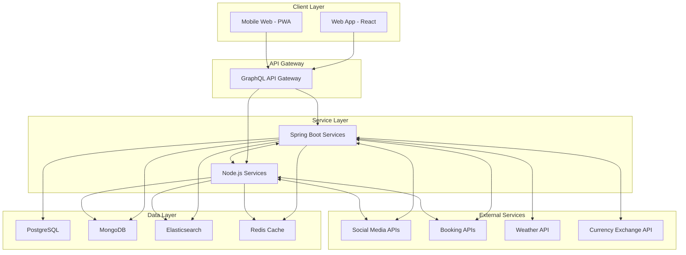
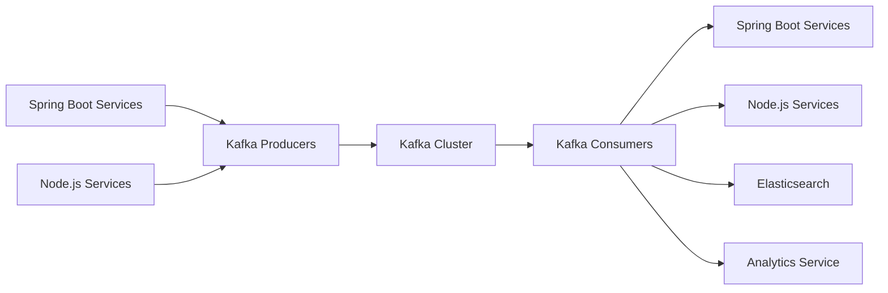
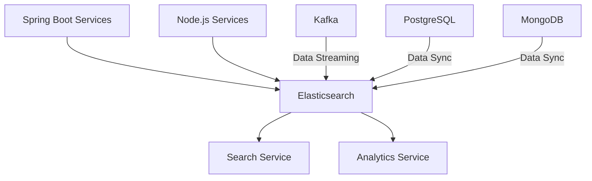
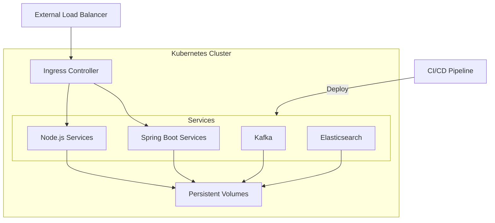

# Project: Travel Itinerary Social Media (Updated)

## Overview
A comprehensive travel itinerary planner that allows users to create, share, and collaborate on travel plans. Users can also discover and interact with other travellers, share experiences, and recommend places. This platform will serve as both a travel planning tool and a social media for travellers.

## Basic Feature List

### Security
- Sign up with email, password, and basic profile information.
- Login with email-password and socials.
- JWT-based authentication for secure API access.
- Password recovery and reset functionality.
- Data Encryption: Ensure end-to-end encryption for sensitive data, especially for messaging and document sharing.

### Profile Management
- View and edit profile information.
- Add and manage past trips and travel experiences.
- Set privacy settings for profile visibility.

### Role-based Access Control
- Different roles for users, admins, and moderators.
- Admin panel for managing users, roles, and content.

### Create and Manage Itineraries
- Create new itineraries with a start date, end date, and trip title.
- Add and organise destinations, activities, and accommodations.
- Set and manage travel dates and times for each activity.
- Categorize activities (sightseeing, dining, shopping, etc.).

### Advanced Search and Filters
- Advance Search: Implement a robust search functionality allowing users to search by destinations, activities, dates, and user profiles.
- Filters: Allow users to filter search results by categories, ratings, price ranges, and more.

### Collaboration
- Invite friends or other users to collaborate on itineraries.
- Real-time updates and notifications for itinerary changes.
- Permission settings for collaborators (view, edit, comment).

### Social Media Integration
- Cross-Posting: Allow users to cross-post their travel stories and experiences to other social media platforms like Facebook, Instagram, and Twitter.

### Booking Integration
- Integration with third-party APIs for booking flights, hotels, and activities.
- Add booking confirmations and details to the itinerary.

### Itinerary Templates
- Save and reuse itinerary templates for future trips.
- Share templates with other users.

### User Connections
- Search and follow other travellers.
- View followers and following lists.
- See activity feeds of the following users.

### Sharing Experiences
- Post travel stories, photos, and reviews.
- Tag locations and itineraries in posts.
- Like, comment, and share posts.

### Messaging System
- Direct messaging between users.
- Group chats for trip planning and collaboration.

### Place Recommendations
- Personalised recommendations for places to visit based on user preferences and past trips.
- Trending destinations and activities based on user ratings and reviews.

### Reviews and Ratings
- Write and read reviews for destinations, activities, and accommodations.
- Rate places on a scale of 1 to 5 stars.
- Filter and sort reviews by date, rating, and relevance.

### Map Visualization
- Visualise travel plans on an interactive map.
- Mark and categorise destinations, activities, and accommodations.
- View route maps for travel between destinations.

### Pinned Recommendations
- See recommended places pinned on the map.
- View reviews and ratings for pinned places.

### Real-Time Chat
- Real-time chat for collaboration on itineraries.
- Group chat for trip planning with multiple users.
- Message notifications and unread message indicators.

### Notifications
- Notifications for itinerary updates, social interactions, and booking confirmations.
- Real-time push notifications for critical updates.

### Photo and Document Sharing
- Upload and share photos related to trips.
- Organise photos by trip and itinerary.
- Share travel documents (tickets, booking confirmations, etc.).

### File Management
- View, download, and delete shared files.
- Set privacy settings for shared files.

### User Activity Reports
- Generate reports on user activity, such as trips planned, places visited, and reviews written.
- Visualise travel history and preferences.

### Gamification Elements
- Badges and Achievement: Add badges, points, and levels for users based on their travel experiences and platform engagement.
- Leaderboard: Implement a leaderboard to encourage competition and engagement among users.
- Challenges: Create travel challenges and quests for users to complete during their trips.

### Trip Analytics
- Analyze trip data, such as expenses, travel duration, and activity types.
- Generate summary reports for completed trips.

### Offline Access
- Allow users to download itineraries for offline access.
- Sync offline changes when the user is back online.

### Third-Party Integrations
- Integrate with social media platforms for sharing and login.
- Integration with travel-related APIs (e.g., weather, currency exchange).

### Dynamic Pricing Alerts (New Feature)
- Integrate with pricing APIs for flights, hotels, and activities.
- Allow users to set price thresholds for items in their itineraries.
- Implement a notification system (email, push notifications) to alert users when prices drop below their set thresholds.
- Create a dashboard where users can manage their price alerts.

## Admin Features

### User Management
- View and manage user accounts.
- Assign and change user roles.
- Handle user reports and disputes.

### Content Moderation
- Review and moderate user posts, reviews, and comments.
- Manage flagged content and handle content violations.

### Analytics Dashboard
- View platform usage statistics and user engagement metrics.
- Monitor active users, new registrations, and user retention.

## Tech Stack

### Frontend
- ReactJS with TypeScript
- React Redux: State management
- React Router: For handling routing
- Axios: For HTTP calls
- Tailwind CSS
- React Query: For efficient data fetching and caching
- WebSockets: For real-time communication
- Next.js: For server-side rendering and improved SEO
- Storybook: For component development and testing

### Backend
- Java Spring Boot: Core backend to handle business logic, API endpoints, and primary data processing
- NodeJs: For server-side scripting, handling real-time features (e.g., chat), and additional data processing
- Socket.IO: For real-time communication
- GraphQL with Apollo Server: For more efficient data querying
- Apache Kafka: For event-driven architecture and real-time data streaming
- Security: JWT-based authentication along with OAuth 2.0 and OpenID Connect for more robust authentication and authorization
- Communication Protocols:
  - Client-Server: GraphQL
  - Inter-Service: gRPC

### Database
- PostgreSQL: Primary database for structured data
- MongoDB: Secondary database for unstructured data such as chat messages and photos, etc.
- Elasticsearch: For advanced search capabilities and improved performance

### Caching
- Redis: Caching to improve performance and manage sessions

### DevOps
- Docker: Containerization
- Kubernetes: Orchestration
- Prometheus & Grafana: For monitoring, alerting, and visualising system performance
- Jenkins: For continuous integration and continuous deployment (CI/CD)
- Terraform: For infrastructure as code
- SonarQube: For code quality and security analysis
- ELK stack (Elasticsearch, Logstash, Kibana): For centralized logging

### Additional Services
- AWS S3 or Google Cloud Storage: For storing user-generated content
- CDN (e.g., Cloudflare or AWS CloudFront): For faster content delivery

## Backend Design Planner

### System Architecture Design
- Create high-level system architecture diagram.




- Define service boundaries between Spring Boot and Node.js components.
    - Spring Boot Services:
        - User Management: Handle user registration, authentication, and profile management.
        - Itinerary Management: Manage creation, editing, and sharing of itineraries.
        - Booking Integration: Handle integration with external booking APIs.
        - Search and Discovery: Manage advanced search functionality and personalized recommendations.
        - Reviews and Ratings: Handle the review and rating system.
    - Node.js Services:
        - Real-time Communication: Manage chat functionality and real-time notifications.
        - Social Features: Handle activity feeds, post creation, and sharing.
        - Dynamic Pricing Alerts: Manage price monitoring and alert notifications.
        - Analytics: Handle user activity tracking and generate reports
```
The service boundaries are defined based on the strengths of each technology:
- Spring Boot is used for core business logic and data-intensive operations.
- Node.js is utilized for real-time features and operations that benefit from its non-blocking I/O.
Both Spring Boot and Node.js services will communicate with each other using gRPC for efficient inter-service communication. They will also both interact with the data layer and external services as needed.
```
- Design database schema for PostgreSQL.
- Design data models for MongoDB.
- Plan Elasticsearch integration for search functionality.
- Design caching strategy with Redis.
- Plan scalability and performance optimizations.

### API Design
- Design GraphQL schema for client-server communication.
- Define gRPC service definitions for inter-service communication.
- Plan RESTful APIs for external integrations.

### Security Architecture
- Design authentication and authorization system.
- Plan data encryption strategies.
- Design secure communication protocols.

## Frontend Design Planner

### UI/UX Design
- Create wireframes for key user interfaces.
- Design responsive layouts for web and mobile.
- Develop UI component library and style guide.
