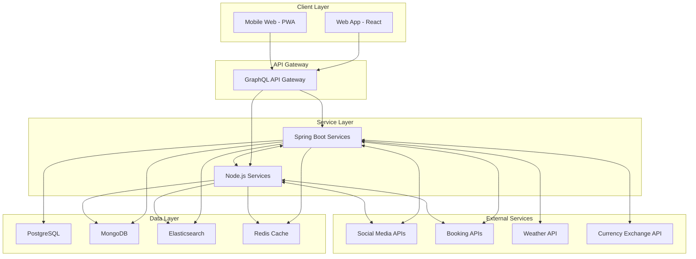
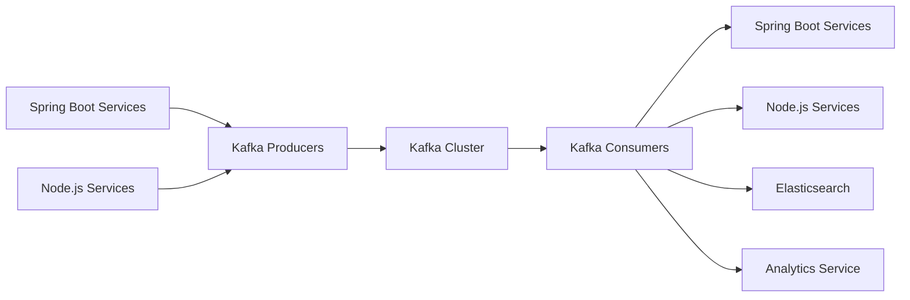
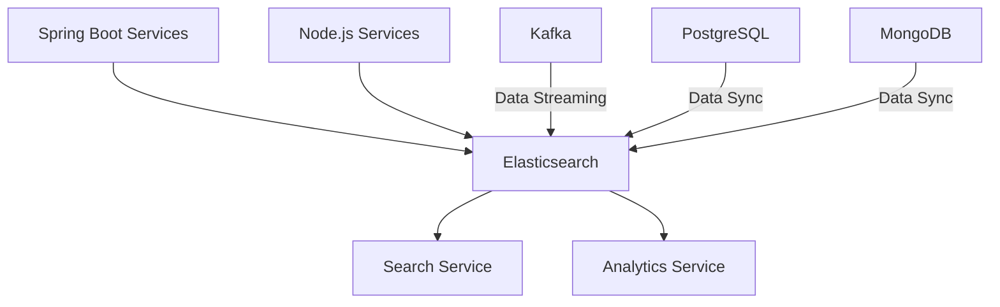
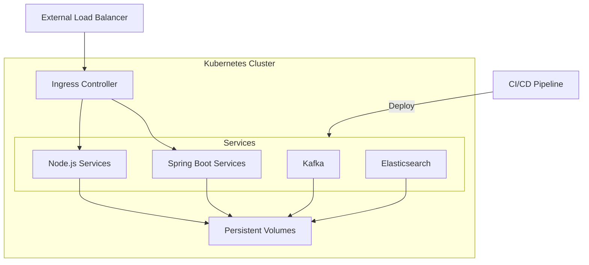

# **Travel Itinerary Social Media**

## **Overview**
A comprehensive travel itinerary planner that allows users to create, share, and collaborate on travel plans. Users can also discover and interact with other travellers, share experiences, and recommend places. This platform will serve as both a travel planning tool and a social media for travellers.
*
## **Basic Feature List**

### ***Security***
- Sign up with email, password, and basic profile information.
- Login with email-password and socials.
- JWT-based authentication for secure API access.
- Password recovery and reset functionality.
- Data Encryption: Ensure end-to-end encryption for sensitive data, especially for messaging and document sharing.

### ***Profile Management***
- View and edit profile information.
- Add and manage past trips and travel experiences.
- Set privacy settings for profile visibility.

### ***Role-based Access Control***
- Different roles for users, admins, and moderators.
- Admin panel for managing users, roles, and content.

### ***Create and Manage Itineraries***
- Create new itineraries with a start date, end date, and trip title.
- Add and organise destinations, activities, and accommodations.
- Set and manage travel dates and times for each activity.
- Categorize activities (sightseeing, dining, shopping, etc.).

### ***Advanced Search and Filters***
- Advance Search: Implement a robust search functionality allowing users to search by destinations, activities, dates, and user profiles.
- Filters: Allow users to filter search results by categories, ratings, price ranges, and more.

### ***Collaboration***
- Invite friends or other users to collaborate on itineraries.
- Real-time updates and notifications for itinerary changes.
- Permission settings for collaborators (view, edit, comment).

### ***Social Media Integration***
- Cross-Posting: Allow users to cross-post their travel stories and experiences to other social media platforms like Facebook, Instagram, and Twitter.

### ***Booking Integration***
- Integration with third-party APIs for booking flights, hotels, and activities.
- Add booking confirmations and details to the itinerary.

### ***Itinerary Templates***
- Save and reuse itinerary templates for future trips.
- Share templates with other users.

### ***User Connections***
- Search and follow other travellers.
- View followers and following lists.
- See activity feeds of the following users.

### ***Sharing Experiences***
- Post travel stories, photos, and reviews.
- Tag locations and itineraries in posts.
- Like, comment, and share posts.

### ***Messaging System***
- Direct messaging between users.
- Group chats for trip planning and collaboration.

### ***Place Recommendations***
- Personalised recommendations for places to visit based on user preferences and past trips.
- Trending destinations and activities based on user ratings and reviews.

### ***Reviews and Ratings***
- Write and read reviews for destinations, activities, and accommodations.
- Rate places on a scale of 1 to 5 stars.
- Filter and sort reviews by date, rating, and relevance.

### ***Map Visualization***
- Visualise travel plans on an interactive map.
- Mark and categorise destinations, activities, and accommodations.
- View route maps for travel between destinations.

### ***Pinned Recommendations***
- See recommended places pinned on the map.
- View reviews and ratings for pinned places.

### ***Real-Time Chat***
- Real-time chat for collaboration on itineraries.
- Group chat for trip planning with multiple users.
- Message notifications and unread message indicators.

### ***Notifications***
- Notifications for itinerary updates, social interactions, and booking confirmations.
- Real-time push notifications for critical updates.

### ***Photo and Document Sharing***
- Upload and share photos related to trips.
- Organise photos by trip and itinerary.
- Share travel documents (tickets, booking confirmations, etc.).

### ***File Management***
- View, download, and delete shared files.
- Set privacy settings for shared files.

### ***User Activity Reports***
- Generate reports on user activity, such as trips planned, places visited, and reviews written.
- Visualise travel history and preferences.

### ***Gamification Elements***
- Badges and Achievement: Add badges, points, and levels for users based on their travel experiences and platform engagement.
- Leaderboard: Implement a leaderboard to encourage competition and engagement among users.
- Challenges: Create travel challenges and quests for users to complete during their trips.

### ***Trip Analytics***
- Analyze trip data, such as expenses, travel duration, and activity types.
- Generate summary reports for completed trips.

### ***Offline Access***
- Allow users to download itineraries for offline access.
- Sync offline changes when the user is back online.

### ***Third-Party Integrations***
- Integrate with social media platforms for sharing and login.
- Integration with travel-related APIs (e.g., weather, currency exchange).

### ***Dynamic Pricing Alerts (New Feature)***
- Integrate with pricing APIs for flights, hotels,* and activities.
- Allow users to set price thresholds for items in their itineraries.
- Implement a notification system (email, push notifications) to alert users when prices drop below their set thresholds.
- Create a dashboard where users can manage their price alerts.

## **Admin Features**

### ***User Management***
- View and manage user accounts.
- Assign and change user roles.
- Handle user reports and disputes.

### ***Content Moderation***
- Review and moderate user posts, reviews, and comments.
- Manage flagged content and handle content violations.

### ***Analytics Dashboard***
- View platform usage statistics and user engagement metrics.
- Monitor active users, new registrations, and user retention.

## **Tech Stack**

### ***Frontend***
- ReactJS with TypeScript
- React Redux: State management
- React Router: For handling routing
- Axios: For HTTP calls
- Tailwind CSS
- React Query: For efficient data fetching and caching
- WebSockets: For real-time communication
- Next.js: For server-side rendering and improved SEO
- Storybook: For component development and testing

### ***Backend***
- Java Spring Boot: Core backend to handle business logic, API endpoints, and primary data processing
- NodeJs: For server-side scripting, handling real-time features (e.g., chat), and additional data processing
- Socket.IO: For real-time communication
- GraphQL with Apollo Server: For more efficient data querying
- Apache Kafka: For event-driven architecture and real-time data streaming
- Security: JWT-based authentication along with OAuth 2.0 and OpenID Connect for more robust authentication and authorization
- Communication Protocols:
  - Client-Server: GraphQL
  - Inter-Service: gRPC

### ***Database***
- PostgreSQL: Primary database for structured data
- MongoDB: Secondary database for unstructured data such as chat messages and photos, etc.
- Elasticsearch: For advanced search capabilities and improved performance
*
### ***Caching***
- Redis: Caching to improve performance and manage sessions

### ***DevOps***
- Docker: Containerization
- Kubernetes: Orchestration
- Prometheus & Grafana: For monitoring, alerting, and visualising system performance
- Jenkins: For continuous integration and continuous deployment (CI/CD)
- Terraform: For infrastructure as code
- SonarQube: For code quality and security analysis
- ELK stack (Elasticsearch, Logstash, Kibana): For centralized logging

### ***Additional Services***
- AWS S3 or Google Cloud Storage: For storing user-generated content
- CDN (e.g., Cloudflare or AWS CloudFront): For faster content delivery

## **Backend Design Planner**

### ***System Architecture Design***
- Create high-level system architecture diagram.




- Define service boundaries between Spring Boot and Node.js components.
    - Spring Boot Services:
        - User Management: Handle user registration, authentication, and profile management.
        - Itinerary Management: Manage creation, editing, and sharing of itineraries.
        - Booking Integration: Handle integration with external booking APIs.
        - Search and Discovery: Manage advanced search functionality and personalized recommendations.
        - Reviews and Ratings: Handle the review and rating system.
    - Node.js Services:
        - Real-time Communication: Manage chat functionality and real-time notifications.
        - Social Features: Handle activity feeds, post creation, and sharing.
        - Dynamic Pricing Alerts: Manage price monitoring and alert notifications.
        - Analytics: Handle user activity tracking and generate reports
```
The service boundaries are defined based on the strengths of each technology:
- Spring Boot is used for core business logic and data-intensive operations.
- Node.js is utilized for real-time features and operations that benefit from its non-blocking I/O.
Both Spring Boot and Node.js services will communicate with each other using gRPC for efficient inter-service communication. They will also both interact with the data layer and external services as needed.
```
- Design database schema for PostgreSQL.
```postgresql
-- Users table
CREATE TABLE Users (
UserID SERIAL PRIMARY KEY,
Email VARCHAR(255) UNIQUE NOT NULL,
PasswordHash VARCHAR(255) NOT NULL,
FirstName VARCHAR(50),
LastName VARCHAR(50),
ProfilePictureURL VARCHAR(255),
Bio TEXT,
Role VARCHAR(20) CHECK (Role IN ('User', 'Admin', 'Moderator'))
);
-- UserPreferences table
CREATE TABLE UserPreferences (
PreferenceID SERIAL PRIMARY KEY,
UserID INTEGER REFERENCES Users(UserID),
PreferenceType VARCHAR(50),
PreferenceValue TEXT
);
-- Trips table
CREATE TABLE Trips (
TripID SERIAL PRIMARY KEY,
UserID INTEGER REFERENCES Users(UserID),
Title VARCHAR(255) NOT NULL,
StartDate DATE,
EndDate DATE,
Description TEXT,
PrivacySetting VARCHAR(20)
);
-- TripCollaborators table
CREATE TABLE TripCollaborators (
CollaborationID SERIAL PRIMARY KEY,
TripID INTEGER REFERENCES Trips(TripID),
UserID INTEGER REFERENCES Users(UserID),
PermissionLevel VARCHAR(20)
);
-- Categories table
CREATE TABLE Categories (
CategoryID SERIAL PRIMARY KEY,
Name VARCHAR(50) UNIQUE NOT NULL,
Type VARCHAR(20) CHECK (Type IN ('Destination', 'Activity'))
);
-- Destinations table
CREATE TABLE Destinations (
DestinationID SERIAL PRIMARY KEY,
TripID INTEGER REFERENCES Trips(TripID),
Name VARCHAR(255) NOT NULL,
Latitude DECIMAL(10, 8),
Longitude DECIMAL(11, 8),
CategoryID INTEGER REFERENCES Categories(CategoryID)
);
-- Activities table
CREATE TABLE Activities (
ActivityID SERIAL PRIMARY KEY,
TripID INTEGER REFERENCES Trips(TripID),
DestinationID INTEGER REFERENCES Destinations(DestinationID),
Name VARCHAR(255) NOT NULL,
StartTime TIMESTAMP,
EndTime TIMESTAMP,
Notes TEXT,
CategoryID INTEGER REFERENCES Categories(CategoryID)
);
-- Reviews table
CREATE TABLE Reviews (
ReviewID SERIAL PRIMARY KEY,
UserID INTEGER REFERENCES Users(UserID),
DestinationID INTEGER REFERENCES Destinations(DestinationID),
Rating INTEGER CHECK (Rating BETWEEN 1 AND 5),
Comment TEXT,
Timestamp TIMESTAMP DEFAULT CURRENT_TIMESTAMP
);
-- Followers table
CREATE TABLE Followers (
FollowerID SERIAL PRIMARY KEY,
UserID INTEGER REFERENCES Users(UserID),
FollowedUserID INTEGER REFERENCES Users(UserID),
Timestamp TIMESTAMP DEFAULT CURRENT_TIMESTAMP
);
-- Bookings table
CREATE TABLE Bookings (
BookingID SERIAL PRIMARY KEY,
UserID INTEGER REFERENCES Users(UserID),
TripID INTEGER REFERENCES Trips(TripID),
Type VARCHAR(50),
ConfirmationNumber VARCHAR(100),
BookingDetails JSONB
);
-- UserAchievements table
CREATE TABLE UserAchievements (
AchievementID SERIAL PRIMARY KEY,
UserID INTEGER REFERENCES Users(UserID),
AchievementName VARCHAR(100),
AchievementDescription TEXT,
DateEarned TIMESTAMP DEFAULT CURRENT_TIMESTAMP
);
```
- Design data models for MongoDB.
```javascript
//Messages Collection
{
_id: Objectid,
senderld: ObjectId,
receiverld: Objectid,
content: String,
createdAt: Date,
updatedAt: Date,
isRead: Boolean
}
//ChatRooms Collection:
{
_id: Objectid,
name: String,
participants: [ObjectId],
createdAt: Date,
updatedAt: Date,
}
//Notifications Collection
{
_id: Objectid,
userId: Objectid,
type: String,
content: String,
isRead: Boolean,
createdAt: Date,
updatedAt: Date,
}
//Posts Collection:
{
_id: ObjectId,
userld: ObjectId,
content: String,
mediaUrls: [String],
likes: [ObjectId],
comments: [
    {
    userld: ObjectId,
    content: String,
    timestamp: Date
    }
],
createdAt: Date,
updatedAt: Date
}
//TripNotes Collection
{
_id: Objectid,
tripld: ObjectId,
userld: Objectid,
content: String,
createdAt: Date,
updatedAt: Date
}
```
- Plan Elasticsearch integration for search functionality.
    - *Use Cases and Requirements*
        - *Advanced Search:* Allow users to search by destinations, activities, dates, and user profiles.
        - *Filters:* Enable filtering of search results by categories, ratings, price ranges, etc.
    - *Data Indexing Strategy*
        - *Documents:* Define documents for indexing, such as user profiles, itineraries, destinations, activities, posts, and reviews.
        - *Mappings:* Create Elasticsearch mappings to define the structure of these documents.
    - *User Profiles:*
    ```json
    {
      "mappings": {
        "properties": {
          "userId": { "type": "keyword" },
          "firstName": { "type": "text" },
          "lastName": { "type": "text" },
          "bio": { "type": "text" },
          "trips": {
            "type": "nested",
            "properties": {
              "tripId": { "type": "keyword" },
              "title": { "type": "text" },
              "startDate": { "type": "date" },
              "endDate": { "type": "date" }
            }
          }
        }
      }
    }
    ```
    - *Itineraries:*
    ```json
    {
      "mappings": {
        "properties": {
          "tripId": { "type": "keyword" },
          "title": { "type": "text" },
          "startDate": { "type": "date" },
          "endDate": { "type": "date" },
          "destinations": {
            "type": "nested",
            "properties": {
              "destinationId": { "type": "keyword" },
              "name": { "type": "text" },
              "latitude": { "type": "float" },
              "longitude": { "type": "float" }
            }
          },
          "activities": {
            "type": "nested",
            "properties": {
              "activityId": { "type": "keyword" },
              "name": { "type": "text" },
              "startTime": { "type": "date" },
              "endTime": { "type": "date" }
            }
          }
        }
      }
    }
    ```
  - *Search Implementation*
    - Develop a search service that interfaces with Elasticsearch.
    - Implement full-text search across all indexed entities.
    - Use multi-match queries for searching across multiple fields:
    ```json
    {
      "multi_match": {
        "query": "beach vacation",
        "fields": ["title", "description", "tags"]
      }
    }
    ```
    - Implement geo-spatial queries for location-based searches:
    ```json
    {
      "geo_distance": {
        "distance": "100km",
        "location": {
          "lat": 40.7128,
          "lon": -74.0060
        }
      }
    }
    ```
    - Use date range queries for trip searches:
    ```json
    {
      "range": {
        "startDate": {
          "gte": "2023-07-01",
          "lte": "2023-08-31"
        }
      }
    }
    ```

  - *Advanced Features*
    - Implement faceted search using aggregations:
    ```json
    {
      "aggs": {
        "popular_tags": {
          "terms": { "field": "tags" }
        }
      }
    }
    ```
    - Use fuzzy matching for typo tolerance:
    ```json
    {
      "match": {
        "title": {
          "query": "beech",
          "fuzziness": "AUTO"
        }
      }
    }
    ```
    - Implement autocomplete functionality using edge ngram tokenizer
    - Use highlighting to show matched terms in search results
  - *Data Ingestion Process*
        - *Real-Time Data Sync:* Use Kafka for real-time data streaming from PostgreSQL and MongoDB to Elasticsearch.
        - *Batch Data Processing:* Implement periodic batch jobs to sync data from the main databases to Elasticsearch.
    - *Search API*
        - *Elasticsearch Query:* Design Elasticsearch queries to support complex search and filter operations.
        - *GraphQL Integration:* Create GraphQL resolvers to interact with Elasticsearch and fetch search results.
    - *Performance Optimization*
        - *Indexing Strategy:* Optimize indexing settings (e.g., number of shards and replicas) based on the expected data volume.
        - *Search Tuning:* Use analyzers, tokenizers, and custom scoring algorithms to enhance search accuracy and performance.
    - *Security and Access Control*
        - *Authentication:* Use JWT for secure access to the search API.
        - *Authorization:* Implement role-based access control to restrict access to certain search functionalities.
- Plan caching strategy with Redis.
  - *Use Cases and Requirements*
    -  Cache-Aside (Lazy Loading)
      -  Implement for frequently accessed, relatively static data (e.g., user profiles, trip details)
  - Write-Through
    - Use for data that needs to be immediately consistent (e.g., user settings, trip collaborators)
  - Time-based Expiration
    - Implement for data that can tolerate some staleness (e.g., popular destinations, trending activities)
    - Set appropriate TTL (Time To Live) based on data volatility
  - Session Management
    - Store session data in Redis for fast access and easy distribution across servers
    - Use Redis' built-in expiration for automatic session cleanup.
  - Rate Limiting
    - Implement rate limiting using Redis' incrementing counters with expiration
  - Leaderboards
    - Use Redis Sorted Sets for efficient leaderboard implementation
  - Distributed Locking
    - Implement distributed locks for managing concurrent access to shared resources
    - Use Redis' atomic operations to ensure lock integrity
  - Eviction Policies
    - Configure appropriate eviction policies based on use case:
      - volatile-lru: Evict least recently used keys with expiration set
      - allkeys-lru: Evict least recently used keys
      - volatile-ttl: Evict keys with shortest time to live
    - *Session Management:* Store user session data to ensure quick retrieval and manage user sessions.
    - *Data Caching:* Cache frequently accessed data to reduce database load and improve response times.
    - *Real-Time Messaging:* Use Redis for real-time messaging and notifications.
  - *Data Caching*
    - *Cache Strategy:* Identify frequently accessed data such as user profiles, itineraries, and search results.
    - *Cache Keys:* Design cache keys to ensure efficient data retrieval.
    - *Example Cache Key:* `userProfile:{userId}`, `itinerary:{tripId}`
    - *Spring Cache Integration:** Use Spring Cache with Redis to manage caching in Spring Boot.
  ```java
  @Cacheable(value = "userProfiles", key = "#userId")
  public UserProfile getUserProfile(String userId) {
    // Method implementation
  }
  ```
  - *Real-Time Messaging*
    - *Publish-Subscribe Model:* Use Redis Pub/Sub for real-time message broadcasting.
    - *Example Channels:* `notifications:{userId}`, `chatRoom:{roomId}`
    - *Redis Integration in Node.js:* Use the `redis` package in Node.js to implement Pub/Sub functionality.
  ```javascript
  const redis = require('redis');
  const subscriber = redis.createClient();
  const publisher = redis.createClient();

  subscriber.subscribe('notifications:user123');

  subscriber.on('message', (channel, message) => {
    console.log(`Received message: ${message} from channel: ${channel}`);
  });

  publisher.publish('notifications:user123', 'New notification message');
  ```
  - *Performance Optimization*
    - *TTL Settings:* Set appropriate TTL for cached data to ensure stale data is evicted.
    - *Eviction Policies:* Use Redis eviction policies (e.g., LRU, LFU) to manage cache size and evict least-used data.
  - *Monitoring and Management*
    - *Redis Monitoring:* Use tools like RedisInsight to monitor Redis performance and manage data.
    - *Cache Metrics:** Integrate with Prometheus and Grafana to visualize cache performance metrics.
  - *Security and Access Control*
    - *Secure Connection:* Use SSL/TLS for secure communication with the Redis server.
    - *Authentication:* Use Redis AUTH to secure access to the Redis instance.

### ***API Design***
- Design GraphQL schema for client-server communication.
- Define gRPC service definitions for inter-service communication.
- Plan RESTful APIs for external integrations.

### ***Security Architecture***
- Design authentication and authorization system.
- Plan data encryption strategies.
- Design secure communication protocols.

## ***Frontend Design Planner***

### ***UI/UX Design***
- Create wireframes for key user interfaces.
- Design responsive layouts for web and mobile.
- Develop UI component library and style guide.

