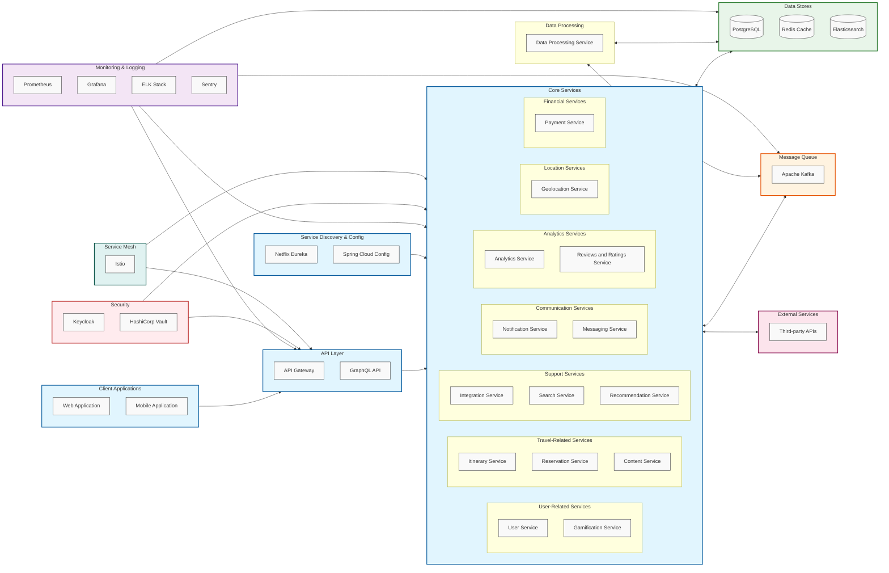

```mermaid
graph LR
    subgraph "Client Applications"
        Web[Web Application]
        Mobile[Mobile Application]
    end

    subgraph "API Layer"
        AG[API Gateway]
        GQL[GraphQL API]
    end

    subgraph "Service Discovery & Config"
        Eureka[Netflix Eureka]
        Config[Spring Cloud Config]
    end

    subgraph "Core Services"
        US[User Service]
        IS[Itinerary Service]
        CS[Content Service]
        RS[Reservation Service]
        IntS[Integration Service]
        SS[Search Service]
        RecS[Recommendation Service]
        NS[Notification Service]
        MS[Messaging Service]
        AS[Analytics Service]
        RRS[Reviews and Ratings Service]
        GS[Geolocation Service]
        PS[Payment Service]
        GamS[Gamification Service]
    end

    subgraph "Data Processing"
        DPS[Data Processing Service]
    end

    subgraph "Data Stores"
        PG[(PostgreSQL)]
        Redis[(Redis Cache)]
        ES[(Elasticsearch)]
    end

    subgraph "Message Queue"
        Kafka[Apache Kafka]
    end

    subgraph "External Services"
        TP[Third-party APIs]
    end

    subgraph "Monitoring & Logging"
        Prometheus[Prometheus]
        Grafana[Grafana]
        ELK[ELK Stack]
        Sentry[Sentry]
    end

    subgraph "Security"
        Keycloak[Keycloak]
        Vault[HashiCorp Vault]
    end

    subgraph "Service Mesh"
        Istio[Istio]
    end

    %% Client to API Layer
    Web --> AG
    Mobile --> AG
    AG --> GQL

    %% API Layer to Core Services (GraphQL)
    GQL --> US
    GQL --> IS
    GQL --> CS
    GQL --> RS
    GQL --> SS
    GQL --> RecS
    GQL --> NS
    GQL --> MS
    GQL --> AS
    GQL --> RRS
    GQL --> GS
    GQL --> PS
    GQL --> GamS

    %% Service-to-Service Communication (gRPC)
    US <--> IS
    US <--> CS
    IS <--> RS
    IS <--> SS
    CS <--> RRS
    RS <--> IntS
    SS <--> ES
    RecS <--> SS
    NS <--> MS
    AS <--> DPS
    GS <--> SS
    PS <--> RS
    GamS <--> US

    %% Services to Data Stores
    US --> PG
    IS --> PG
    CS --> PG
    RS --> PG
    SS --> ES
    RecS --> Redis
    NS --> Redis
    MS --> PG
    AS --> PG
    RRS --> PG
    GS --> PG
    PS --> PG
    GamS --> PG

    %% Services to Message Queue
    US --> Kafka
    IS --> Kafka
    CS --> Kafka
    RS --> Kafka
    IntS --> Kafka
    SS --> Kafka
    RecS --> Kafka
    NS --> Kafka
    MS --> Kafka
    AS --> Kafka
    RRS --> Kafka
    GS --> Kafka
    PS --> Kafka
    GamS --> Kafka

    %% Data Processing
    DPS --> Kafka
    DPS --> PG
    DPS --> ES

    %% External Integrations
    IntS --> TP
    PS --> TP

    %% Service Discovery & Config
    Eureka --> US
    Eureka --> IS
    Eureka --> CS
    Eureka --> RS
    Eureka --> IntS
    Eureka --> SS
    Eureka --> RecS
    Eureka --> NS
    Eureka --> MS
    Eureka --> AS
    Eureka --> RRS
    Eureka --> GS
    Eureka --> PS
    Eureka --> GamS

    Config --> US
    Config --> IS
    Config --> CS
    Config --> RS
    Config --> IntS
    Config --> SS
    Config --> RecS
    Config --> NS
    Config --> MS
    Config --> AS
    Config --> RRS
    Config --> GS
    Config --> PS
    Config --> GamS

    %% Monitoring & Logging
    Prometheus --> US
    Prometheus --> IS
    Prometheus --> CS
    Prometheus --> RS
    Prometheus --> IntS
    Prometheus --> SS
    Prometheus --> RecS
    Prometheus --> NS
    Prometheus --> MS
    Prometheus --> AS
    Prometheus --> RRS
    Prometheus --> GS
    Prometheus --> PS
    Prometheus --> GamS
    Prometheus --> AG
    Prometheus --> GQL
    Prometheus --> Kafka
    Prometheus --> PG
    Prometheus --> Redis
    Prometheus --> ES

    Grafana --> Prometheus

    ELK --> US
    ELK --> IS
    ELK --> CS
    ELK --> RS
    ELK --> IntS
    ELK --> SS
    ELK --> RecS
    ELK --> NS
    ELK --> MS
    ELK --> AS
    ELK --> RRS
    ELK --> GS
    ELK --> PS
    ELK --> GamS
    ELK --> AG
    ELK --> GQL

    Sentry --> US
    Sentry --> IS
    Sentry --> CS
    Sentry --> RS
    Sentry --> IntS
    Sentry --> SS
    Sentry --> RecS
    Sentry --> NS
    Sentry --> MS
    Sentry --> AS
    Sentry --> RRS
    Sentry --> GS
    Sentry --> PS
    Sentry --> GamS
    Sentry --> AG
    Sentry --> GQL

    %% Security
    Keycloak --> US
    Keycloak --> IS
    Keycloak --> CS
    Keycloak --> RS
    Keycloak --> IntS
    Keycloak --> SS
    Keycloak --> RecS
    Keycloak --> NS
    Keycloak --> MS
    Keycloak --> AS
    Keycloak --> RRS
    Keycloak --> GS
    Keycloak --> PS
    Keycloak --> GamS
    Keycloak --> AG

    Vault --> US
    Vault --> IS
    Vault --> CS
    Vault --> RS
    Vault --> IntS
    Vault --> SS
    Vault --> RecS
    Vault --> NS
    Vault --> MS
    Vault --> AS
    Vault --> RRS
    Vault --> GS
    Vault --> PS
    Vault --> GamS
    Vault --> AG

    %% Service Mesh
    Istio --> US
    Istio --> IS
    Istio --> CS
    Istio --> RS
    Istio --> IntS
    Istio --> SS
    Istio --> RecS
    Istio --> NS
    Istio --> MS
    Istio --> AS
    Istio --> RRS
    Istio --> GS
    Istio --> PS
    Istio --> GamS
    Istio --> AG

    %% Styling
    classDef default fill:#f9f9f9,stroke:#333,stroke-width:2px;
    classDef highlight fill:#e1f5fe,stroke:#01579b,stroke-width:2px;
    classDef data fill:#e8f5e9,stroke:#2e7d32,stroke-width:2px;
    classDef queue fill:#fff3e0,stroke:#e65100,stroke-width:2px;
    classDef external fill:#fce4ec,stroke:#880e4f,stroke-width:2px;
    classDef monitor fill:#f3e5f5,stroke:#4a148c,stroke-width:2px;
    classDef security fill:#ffebee,stroke:#b71c1c,stroke-width:2px;
    classDef mesh fill:#e0f2f1,stroke:#004d40,stroke-width:2px;

    class Web,Mobile highlight;
    class AG,GQL highlight;
    class US,IS,CS,RS,IntS,SS,RecS,NS,MS,AS,RRS,GS,PS,GamS highlight;
    class PG,Redis,ES data;
    class Kafka queue;
    class TP external;
    class Prometheus,Grafana,ELK,Sentry monitor;
    class Keycloak,Vault security;
    class Istio mesh;
    class Eureka,Config highlight;
    class DPS highlight;
```

```mermaid
flowchart LR
    %% Define subgraphs
    subgraph Client["Client Applications"]
        direction TB
        Web["Web Application"]
        Mobile["Mobile Application"]
    end

    subgraph API["API Layer"]
        direction TB
        AG["API Gateway"]
        GQL["GraphQL API"]
    end

    subgraph Discovery["Service Discovery & Config"]
        direction TB
        Eureka["Netflix Eureka"]
        Config["Spring Cloud Config"]
    end

    subgraph CoreServices["Core Services"]
        direction LR
        subgraph UserRelated["User-Related Services"]
            US["User Service"]
            GamS["Gamification Service"]
        end
        subgraph TravelRelated["Travel-Related Services"]
            IS["Itinerary Service"]
            RS["Reservation Service"]
            CS["Content Service"]
        end
        subgraph SupportServices["Support Services"]
            IntS["Integration Service"]
            SS["Search Service"]
            RecS["Recommendation Service"]
        end
        subgraph CommunicationServices["Communication Services"]
            NS["Notification Service"]
            MS["Messaging Service"]
        end
        subgraph AnalyticsServices["Analytics Services"]
            AS["Analytics Service"]
            RRS["Reviews and Ratings Service"]
        end
        subgraph LocationServices["Location Services"]
            GS["Geolocation Service"]
        end
        subgraph FinancialServices["Financial Services"]
            PS["Payment Service"]
        end
    end

    subgraph DataProcessing["Data Processing"]
        DPS["Data Processing Service"]
    end

    subgraph DataStores["Data Stores"]
        PG[("PostgreSQL")]
        Redis[("Redis Cache")]
        ES[("Elasticsearch")]
    end

    subgraph MessageQueue["Message Queue"]
        Kafka["Apache Kafka"]
    end

    subgraph ExternalServices["External Services"]
        TP["Third-party APIs"]
    end

    subgraph Monitoring["Monitoring & Logging"]
        Prometheus["Prometheus"]
        Grafana["Grafana"]
        ELK["ELK Stack"]
        Sentry["Sentry"]
    end

    subgraph Security["Security"]
        Keycloak["Keycloak"]
        Vault["HashiCorp Vault"]
    end

    subgraph ServiceMesh["Service Mesh"]
        Istio["Istio"]
    end

    %% Define connections
    Client --> API
    API --> CoreServices
    CoreServices <--> DataStores
    CoreServices <--> MessageQueue
    CoreServices <--> ExternalServices
    DataProcessing <--> MessageQueue
    DataProcessing <--> DataStores
    Discovery --> CoreServices
    Monitoring --> CoreServices
    Monitoring --> API
    Monitoring --> DataStores
    Monitoring --> MessageQueue
    Security --> CoreServices
    Security --> API
    ServiceMesh --> CoreServices
    ServiceMesh --> API

    %% Styling
    classDef default fill:#f9f9f9,stroke:#333,stroke-width:1px;
    classDef highlight fill:#e1f5fe,stroke:#01579b,stroke-width:2px;
    classDef data fill:#e8f5e9,stroke:#2e7d32,stroke-width:2px;
    classDef queue fill:#fff3e0,stroke:#e65100,stroke-width:2px;
    classDef external fill:#fce4ec,stroke:#880e4f,stroke-width:2px;
    classDef monitor fill:#f3e5f5,stroke:#4a148c,stroke-width:2px;
    classDef security fill:#ffebee,stroke:#b71c1c,stroke-width:2px;
    classDef mesh fill:#e0f2f1,stroke:#004d40,stroke-width:2px;

    class Client,API,CoreServices,Discovery highlight;
    class DataStores data;
    class MessageQueue queue;
    class ExternalServices external;
    class Monitoring monitor;
    class Security security;
    class ServiceMesh mesh;
```
