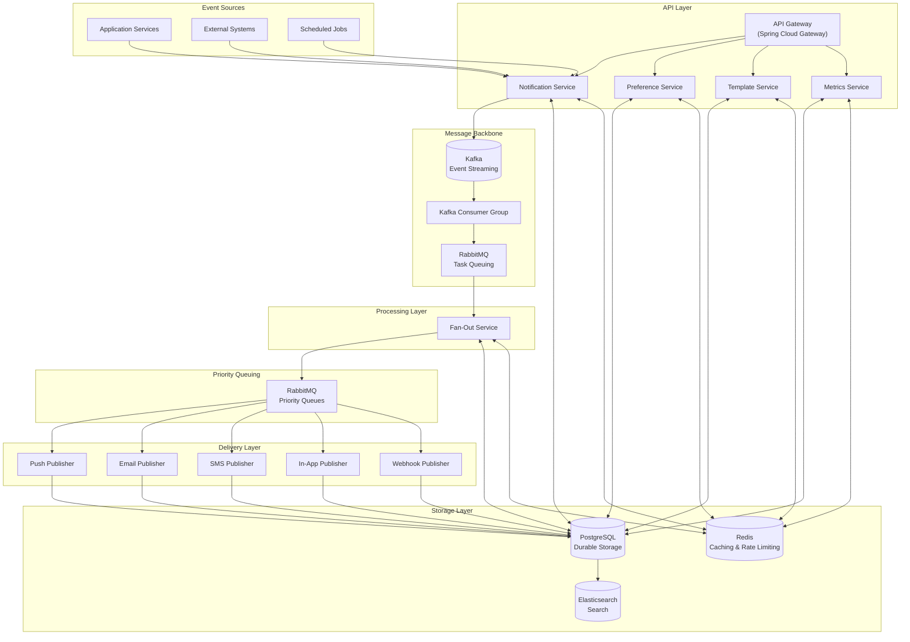
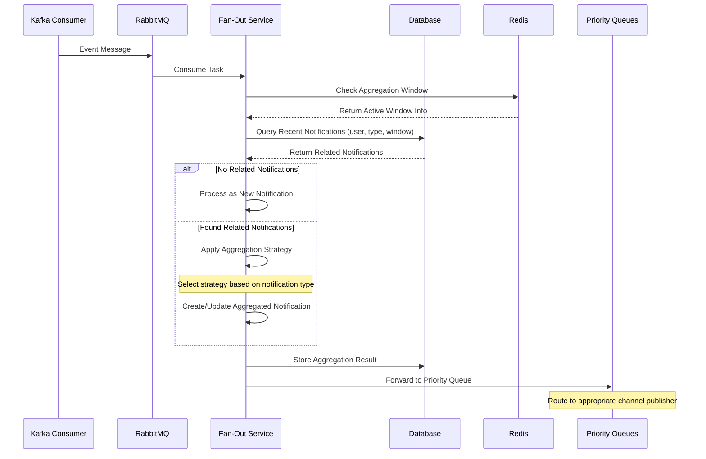

# Notification Service Design Document

## 1. Introduction
This document outlines the design for a robust, scalable notification service supporting multiple notification channels, user preferences, and efficient fan-out mechanisms. This portfolio project demonstrates expertise in distributed systems architecture at the 3-year experience level, focusing on scalability, reliability, and modern architectural patterns while remaining implementable by a single developer.

## 2. Goals
* **Reliability:** Ensure guaranteed notification delivery with comprehensive failure handling and smart retry mechanisms
* **Scalability:** Handle millions of notifications and users with horizontal scaling capabilities
* **Flexibility:** Support diverse notification types and channels with a pluggable architecture
* **Configurability:** Provide granular user notification preference management
* **Maintainability:** Implement a modular, well-documented design with clear service boundaries
* **Performance:** Optimize for low-latency notification delivery while maintaining system efficiency

## 3. Features

### Notification Types:
* Push Notifications (Mobile & Web)
* SMS Notifications
* Email Notifications
* In-App Notifications (Persisted)
* Webhook Notifications (Send to arbitrary URLs)
* Chat Platform Integrations (Slack, Teams, Discord)

### Notification Aggregation:
* Intelligent grouping of related notifications to reduce user fatigue
* Time-window based batching with configurable thresholds
* Priority-based overrides for critical notifications

### Notification Configuration:
* Granular user preferences:
  * Channel selection (enable/disable specific channels)
  * Notification types (e.g., "New Comment," "Friend Request")
  * Frequency controls (max notifications per day/hour per type)
  * Quiet hours with timezone awareness
  * Digest options (daily/weekly summaries instead of individual notifications)

### Notification Intelligence:
* Smart notification routing based on:
  * User engagement patterns and historical response data
  * Device context (mobile vs desktop)
  * Content relevance scoring
  * Real-time user activity status

### Actionable Notifications:
* Rich interactive elements within notifications
* Deep linking with context preservation
* Action confirmation and completion tracking
* **"onClick" Handling:** Client UIs remain "dumb." Notifications include an `action_url` field that directs users to the appropriate location/action within the application

## 4. System Architecture

The system follows a carefully buffered, event-driven architecture with clear separation of concerns:

1. **Notification Producers:**
   * Application services publish domain events to Kafka topics with `Correlation ID` in message headers for tracing
   * Use the transactional outbox pattern for guaranteed delivery
   * Implement idempotent producers to prevent duplicate events
   * Each event includes transaction metadata, correlation ID, and causation ID for complete traceability

2. **API Gateway (Spring Cloud Gateway):**
   * Handles authentication via JWT+OAuth2 with Spring Security
   * Circuit breaking with Resilience4j
   * Rate limiting with sliding window algorithm (100 req/sec per client)
   * WebSocket support for real-time notifications
   * Request validation and sanitization

3. **Core Services:**
   * **Notification Service:** Manages notification lifecycle and provides REST APIs
   * **Preference Service:** Handles user notification preferences with fast read paths
   * **Template Service:** Manages notification templates with versioning and localization
   * **Metrics Service:** Provides analytics on notification performance and engagement

4. **Kafka Event Bus:**
   * Serves as the durable event log and central event ingestion hub
   * Topic partitioning by `user_id` with consistent hashing to prevent hot partitions
   * Retention policy configured for disaster recovery needs (7 days)
   * Schema registry for event validation and evolution
   * Exactly-once semantics using transactional outbox pattern

5. **Kafka Consumer Group (Pre-Fan-Out):**
   * Consumes from Kafka and publishes to RabbitMQ
   * **Critical buffer layer** that prevents overwhelming downstream processing components
   * Performs lightweight validation and initial routing
   * Ensures ordered processing within each Kafka partition
   * **Idempotency Check:** Uses Redis (`idempotency:{idempotency_key}`) to prevent duplicate processing
   * Acknowledges to Kafka *only after* successful enqueue to RabbitMQ
   * **Error Handling:** Implements exponential backoff with jitter (initial delay: 1s, max delay: 60s, max retries: 5)
   * Messages exceeding retries move to a Dead Letter Topic (DLT) for manual inspection

6. **RabbitMQ Task Queue Layer:**
   * Receives tasks from Kafka consumers
   * Provides message buffering when downstream services are slow
   * Implements a direct exchange (`notifications.exchange`) with a main queue (`fanout.queue`)
   * Configured with appropriate DLQ (`fanout.dlq`) for failed messages
   * Enables back-pressure mechanisms to protect the system during high load

7. **Fan-Out Service (RabbitMQ Consumers):**
   * Consumes from RabbitMQ (`fanout.queue`)
   * Performs complex processing:
     * Database lookups for user preferences (with Redis caching)
     * Notification filtering based on user preferences
     * Notification aggregation logic
     * Channel selection based on user context
   * Uses asynchronous processing with bounded thread pool (core: 10, max: 50, queue: 100)
   * Publishes to priority-specific RabbitMQ publisher queues
   * Acknowledges RabbitMQ messages only after successful publishing to priority queues

8. **RabbitMQ Priority Queues:**
   * Separate queues for different priority levels:
     * `notifications.critical_priority`
     * `notifications.high_priority`
     * `notifications.medium_priority`
     * `notifications.low_priority`
   * Each with corresponding DLQ for failed processing
   * Provides final buffering layer before external delivery
   * TTLs configured based on priority (shorter for critical notifications)

9. **Channel-Specific Publishers:**
   * Consume from priority-specific RabbitMQ queues
   * Stateless and independently scalable
   * Handle delivery to external notification channels
   * Implement channel-specific retry logic and circuit breakers
   * Perform final idempotency checks before external delivery
   * Update notification status in the database after delivery attempts

   | Channel | Technology | Retry Policy | Circuit Breaker |
   |---------|------------|--------------|-----------------|
   | SMS | Twilio API with failover to alternative providers | Exponential backoff (max 3 retries, 5s initial delay) | Half-open after 5m, 5 consecutive failures |
   | Email | SendGrid primary, SMTP fallback | Tiered retry (30s, 2m, 10m, 30m, 2h) | Half-open after 10m, 10 consecutive failures |
   | Push | Firebase Cloud Messaging with APNs direct fallback | Exponential backoff up to 1hr | Half-open after 3m, 15 consecutive failures |
   | Webhook | Custom HTTP client with connection pooling | Exponential backoff with jitter (max 5 retries) | Dynamic thresholds based on endpoint health |

10. **Storage Layer:**
    * **PostgreSQL:** Durable storage with appropriate sharding strategy
    * **Redis:** Caching, rate limiting, and ephemeral data
    * **Elasticsearch:** Search capabilities

## 5. Intelligent Notification Routing

The Fan-Out Service implements a sophisticated decision tree to determine the optimal notification channel based on:

1. **User Context Factors:**
   * Current device activity (active session detection)
   * Historical engagement patterns (which channels get responses)
   * Time of day and user timezone
   * Current notification volume (prevent overwhelming)

2. **Content Factors:**
   * Notification priority and urgency
   * Content type and complexity
   * Required user action (if any)
   * Related notification history

3. **System Factors:**
   * Channel availability and health
   * Delivery speed requirements
   * Cost optimization considerations
   * Regulatory requirements (e.g., GDPR, CCPA)

## 6. Advanced Aggregation Logic

The Fan-Out Service implements multiple aggregation strategies:

1. **Count-Based Aggregation:**
   * For high-volume similar notifications
   * "John and 5 others liked your post"
   * Uses a time-window approach (typically 15-30 minutes)

2. **Thread-Based Aggregation:**
   * For conversation-style notifications
   * Aggregates multiple replies into a conversation thread
   * Maintains context and relationship between messages

3. **Summary-Based Aggregation:**
   * For periodic digests
   * "You have 12 new notifications from 5 different apps"
   * Triggered by schedule or threshold-based rules

4. **Priority-Based Override:**
   * Critical notifications bypass aggregation
   * Urgent security alerts delivered immediately
   * Prevents important messages from being delayed

Aggregation process:
1. Check for existing `AggregatedNotification` (same `user_id` and `notification_type`)
2. If exists: Update `AggregatedNotification` and link new `Notification`
3. If not exists: Create new `AggregatedNotification` and link new `Notification`
4. Fan-Out service uses `AggregatedNotification` for the latest message content

## 7. Database Schema and Data Model

### 7.1 PostgreSQL Schema

* **`notification_templates`:**
  - `template_id` (UUID, Primary Key)
  - `name` (VARCHAR(255))
  - `version` (INTEGER)
  - `content` (TEXT)
  - `variables` (JSONB)
  - `created_at` (TIMESTAMP WITH TIME ZONE)
  - **Indexes:** `name, version` (unique)

* **`aggregated_notifications`:**
  - `aggregated_notification_id` (UUID, Primary Key)
  - `user_id` (BIGINT, Foreign Key)
  - `notification_type` (VARCHAR(255))
  - `content` (TEXT)
  - `action_url` (VARCHAR(2048))
  - `priority` (VARCHAR(50))
  - `context` (JSONB)
  - `metadata` (JSONB)
  - `count` (INTEGER)
  - `first_created_at` (TIMESTAMP WITH TIME ZONE)
  - `last_updated_at` (TIMESTAMP WITH TIME ZONE)
  - `expiry_date` (TIMESTAMP WITH TIME ZONE)
  - **Indexes:**
    - `user_id, notification_type` (B-tree)
    - `last_updated_at` (B-tree)
    - `priority` (B-tree)
    - `context` (GIN for JSON querying)

* **`notifications`:**
  - `notification_id` (UUID, Primary Key)
  - `aggregated_notification_id` (UUID, Foreign Key, nullable)
  - `user_id` (BIGINT, Foreign Key)
  - `notification_type` (VARCHAR(255))
  - `template_id` (UUID, Foreign Key, nullable)
  - `channel` (VARCHAR(50))
  - `content` (TEXT)
  - `status` (VARCHAR(50))
  - `error_details` (TEXT, nullable)
  - `delivery_attempts` (INTEGER)
  - `metadata` (JSONB)
  - `correlation_id` (UUID)
  - `created_at` (TIMESTAMP WITH TIME ZONE)
  - `sent_at` (TIMESTAMP WITH TIME ZONE, nullable)
  - `read_at` (TIMESTAMP WITH TIME ZONE, nullable)
  - `acted_on_at` (TIMESTAMP WITH TIME ZONE, nullable)
  - **Indexes:**
    - `user_id, created_at` (B-tree)
    - `status` (B-tree)
    - `correlation_id` (Hash)
    - Partial index on `status='pending'`

* **`user_notification_preferences`:**
  - `preference_id` (UUID, Primary Key)
  - `user_id` (BIGINT)
  - `notification_type` (VARCHAR(255))
  - `channel` (VARCHAR(50))
  - `enabled` (BOOLEAN)
  - `priority_threshold` (VARCHAR(50))
  - `quiet_hours_start` (TIME, nullable)
  - `quiet_hours_end` (TIME, nullable)
  - `timezone` (VARCHAR(50))
  - `daily_limit` (INTEGER, nullable)
  - `weekly_limit` (INTEGER, nullable)
  - `digest_frequency` (VARCHAR(50), nullable)
  - `last_updated` (TIMESTAMP WITH TIME ZONE)
  - **Indexes:**
    - `user_id, notification_type, channel` (unique)

* **`notification_delivery_stats`:**
  - `stat_id` (UUID, Primary Key)
  - `user_id` (BIGINT)
  - `notification_type` (VARCHAR(255))
  - `channel` (VARCHAR(50))
  - `date` (DATE)
  - `sent_count` (INTEGER)
  - `success_count` (INTEGER)
  - `failure_count` (INTEGER)
  - `read_count` (INTEGER)
  - `action_count` (INTEGER)
  - **Indexes:**
    - `user_id, date` (B-tree)
    - `notification_type, date` (B-tree)

### 7.2 Redis Data Structures

* **User Preferences Cache:**
  - Key: `user:preferences:{user_id}`
  - Value: Hash of preference settings
  - TTL: 30 minutes

* **Rate Limiting:**
  - Key: `ratelimit:{user_id}:{notification_type}:{channel}:{timewindow}`
  - Value: Sorted set with message timestamps
  - TTL: Based on time window (hourly, daily)

* **Idempotency Control:**
  - Key: `idempotency:{idempotency_key}`
  - Value: Processing status
  - TTL: 48 hours

* **Template Cache:**
  - Key: `template:{template_id}:{locale}`
  - Value: Rendered template with placeholders
  - TTL: 24 hours, invalidated on template updates

* **Device Status:**
  - Key: `device:status:{device_id}`
  - Value: Hash with last seen time, app state
  - TTL: 15 minutes

* **Aggregation Windows:**
  - Key: `aggregation:{user_id}:{notification_type}:{window_id}`
  - Value: Set of notification IDs in the current aggregation window
  - TTL: Based on aggregation window (15-30 minutes)
