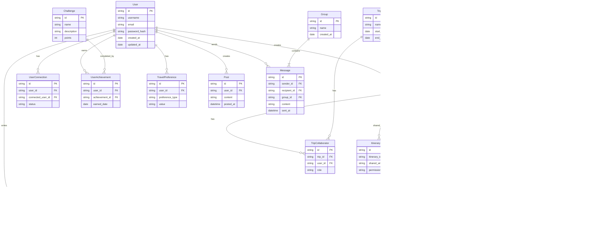

# Travel Platform Backend Engineering Specifications

## 1. Project Overview

The Travel Platform is a comprehensive system that combines travel itinerary planning with social media features. Key functionalities include:

- User authentication and profile management
- Itinerary creation, sharing, and collaboration
- Destination search and filtering
- Integration with third-party travel services for bookings
- Social features: user connections, experience sharing, messaging, following, liking, commenting
- Recommendations
- Review and rating system
- Photo and document sharing
- Gamification elements
- Trip analytics
- Budget tracking
- Travel buddy matching
- Interactive maps

The platform is designed to be highly scalable, starting with an initial load of 100,000 users but with the capability to handle significant growth.

## 2. System Architecture

The system follows a microservices architecture, leveraging Spring Boot for the core backend services. The architecture is designed for scalability, maintainability, and high performance.

### Key Components:

1. **Client Applications**: Web and mobile interfaces (managed by a separate frontend team)
2. **API Gateway**: Entry point for all client requests, handling routing and load balancing
3. **GraphQL API Layer**: Provides flexible data fetching for clients
4. **Microservices**:
   - User Service
   - Itinerary Service
   - Content Service
   - Reservation Service
   - Integration Service
   - Search Service
   - Recommendation Service
   - Notification Service
   - Messaging Service
   - Analytics Service
   - Reviews and Ratings Service
   - Geolocation Service
   - Payment Service
   - Gamification Service
5. **Data Processing Service**: Handles batch processing tasks
6. **Databases**: 
   - PostgreSQL cluster for primary data storage
   - Redis for caching
   - Elasticsearch for efficient full-text search
7. **Message Queue**: Apache Kafka for asynchronous communication
8. **Service Discovery**: Netflix Eureka
9. **Configuration Management**: Spring Cloud Config
10. **Monitoring & Logging**: Prometheus, Grafana, ELK Stack, and Sentry
11. **External Services**: Integration of Third Party APIs such as Social Media APIs, Booking APIs, Weather APIs, Currency Exchange APIs
12. **Service Mesh**: Istio for enhanced security, observability, and traffic management

### Brief Backend Design


## 3. Technology Stack

### Core Backend:
- **Language**: Java 
- **Framework**: Spring Boot
- **Build Tool**: Gradle - Kotlin
- **Client-Server API**: GraphQL (with graphql-java and graphql-java-tools)
- **Service-to-Service Communication**: gRPC (with grpc-spring-boot-starter)
- **Data Serialization**: Apache Avro
- **Authentication & Authorization**: Spring Security with:
   - JWT along with OAuth 2 and OpenID Connect
   - Keycloak for identity and access management
- **Real-Time Communication**: Socket.IO
- **Database**: PostgreSQL (primary datastore)
- **ORM**: Spring Data JPA
- **Caching**: Redis
- **Message Queue**: Apache Kafka
- **Search Engine**: Elasticsearch
- **Documentation**: Swagger API
- **Development Environment**: A consistent development environment using Docker Compose

### Microservices:
- **Service Discovery**: Netflix Eureka
- **API Gateway**: Spring Cloud Gateway (with GraphQL support)
- **Circuit Breaker**: Resilience4j
- **Configuration Management**: Spring Cloud Config
- **Distributed Tracing**: Zipkin
- **Secrets Management**: HashiCorp Vault

### DevOps & Monitoring:
- **Containerization**: Docker
- **Container Orchestration**: Kubernetes
- **CI/CD**: Jenkins
- **Monitoring**: Prometheus & Grafana
- **Logging**: ELK Stack (Elasticsearch, Logstash, Kibana)
- **Error Tracking**: Sentry

### Additional Tools:
- **Version Control**: Git
- **API Documentation**: GraphQL Playground, gRPC reflection
- **AWS S3**: For storing user-generated content
- **AWS CloudFront**: For faster content delivery
- **Feature Flags**: Togglz
- **API Versioning**: Custom header-based versioning or content negotiation
- **Distributed Transaction Management**: Saga pattern implementation

## 4. Data Model

The system's data model is designed to support all the required functionalities efficiently. Key entities include:

1. **User**: Stores user account information
2. **Itinerary**: Represents a user's travel plan
3. **ItineraryItem**: Individual items within an itinerary
4. **Trips**: Information about user trips
5. **TripCollaborators**: Represents collaborators with permissions and tasks if users are collaborating for a trip
6. **Destination**: Information about travel destinations
7. **Activities**: Information about activities planned during trip
8. **Reviews & Rating**: For reviews and rating of itinerary, user, trips, destination, etc.
9. **UserConnection**: Represents connections between users
10. **UserAchievements**: Represents different kinds of achievements and badges which users have won
11. **Messages**: For real-time user-user encrypted chatting system
12. **Groups/ChatRooms**: For real-time encrypted group-chatting system
13. **Post**: User-generated content for sharing experiences
14. **Booking**: Travel service bookings associated with itinerary items
15. **ItineraryShare**: Tracks shared itineraries and permissions
16. **Achievement**: Tracks user achievements and progress in the gamification system
17. **Challenge**: Represents gamification challenges or quests
18. **Payment**: Stores transaction details
19. **TravelPreference**: Stores user's travel preferences for recommendations
_Include a version field for entities that might require versioning for conflict resolution in collaborative editing scenarios_

### ER Diagram



## 5. API Design

### GraphQL API

The system uses GraphQL for client-server communication, providing a flexible and efficient way for clients to request exactly the data they need.

#### Schema Design Principles:
- Define clear and descriptive types for each entity
- Use input types for mutations to ensure type safety
- Implement connections for paginated lists
- Utilize custom scalars for dates and other complex types
- Design nested resolvers for related data
- Implement API versioning for smoother updates and backward compatibility

### gRPC Services

gRPC is used for efficient service-to-service communication within the backend.

#### Service Definition Principles:
- Define clear and concise service methods
- Use protocol buffers (protobuf) for strong typing
- Implement streaming for real-time data where appropriate
- Design reusable message types

### API Versioning

The system uses a header-based versioning approach or content negotiation for a cleaner API structure:

- Use custom headers (e.g., `Accept-version: v1`) or content negotiation (e.g., `Accept: application/vnd.travelplatform.v1+json`) for versioning
- Maintain at least one previous version when introducing changes
- Document breaking changes and provide migration guides
- Use API gateways to route requests to appropriate service versions
- Implement feature toggles for gradual rollout of new API versions

## 6. Services Implementations

Each microservice is implemented as a separate Spring Boot application, adhering to the following principles:

- Single Responsibility: Each service focuses on a specific domain or functionality
- Loose coupling: Each microservice should be independent and communicate with other services through APIs
- Autonomy: Services can be developed, deployed, and scaled independently
- Resilience: Implement circuit breakers and fallback mechanisms
- Data Isolation: Each service manages its own data store
- Data Consistency: Ensure data consistency between Microservices
- Asynchronous Communication: Use Kafka for event-driven interactions between services
- Versioning: For reducing the microservice drift, this results in minimizing the disruption to the existing clients using the services

### Key Services:

1. **User Service**:
   - Implement JWT-based authentication
   - Handle user registration and login
   - Implement OAuth 2 and OpenID Connect protocols
   - Manage user profiles
   - Handle user preferences and settings
   - Implement friend/connection management

2. **Itinerary Service**:
   - Create, edit, and manage travel itineraries
   - Handle itinerary sharing and collaboration
   - Integrate with Booking Service for reservations

3. **Content Service**:
   - Manage user posts and interactions
   - Implement activity feeds
   - Handle comments and likes

4. **Reservation Service**
    - Manage booking processes
    - Handle reservation status and updates

5. **Search Service**:
   - Manage advanced search functionality
   - Integrate with User and Itinerary services for data

6. **Recommendation Service**:
   - Generate personalized travel recommendations (Without AI or LLMs Or ML)
   - Process user behavior data for improved suggestions

7. **Notification Service**:
   - Handle various types of notifications (email, push, in-app)
   - Manage notification preferences and delivery

8. **Analytics Service**:
   - Process user behavior data
   - Generate insights and reports
   - Support data-driven decision making

9. **Reviews and Ratings Service**:
   - Handle the review and rating system

10. **Messaging Service**:
    - Manage real-time chat functionality
    - Ensure all messages are encrypted for security purposes

11. **Gamification Service**:
    - Manage user achievements and badges
    - Handle point systems and leaderboards
    - Create and manage challenges or quests

12. **Payment Service**:
    - Handle financial transactions securely
    - Integrate with various payment gateways
    - Manage refunds and currency conversions
    - Store and retrieve payment history

13. **Integration Service** (split from Booking Service):
    - Integrate with third-party travel APIs
    - Manage API credentials and rate limits
    - Handle data transformation between external APIs and internal services

14. **Geolocation Service**:
    - Provide location-based features
    - Calculate distances and proximity
    - Integrate with mapping services

_Implement service-level rate limiting for more granular control_

### UML Class Diagram


## 7. Data Flow

The data flow in the system follows these general patterns:

1. Client requests come through the API Gateway
2. GraphQL API layer handles query/mutation resolution
3. GraphQL resolvers interact with appropriate microservices via gRPC
4. Microservices process requests, interacting with databases and caches
5. Asynchronous events are published to Kafka for inter-service communication
6. Data Processing Service consumes events for batch processing and analytics
7. Implement event sourcing or the Saga pattern for managing distributed transactions and ensuring data consistency across microservices
8. Use distributed tracing tools like Zipkin to monitor request flow across services

### Dataflow Diagram


## 8. Security Considerations

Security is a critical aspect of the system design:

- **Authentication & Authorization**:
   - Implement OAuth 2 and OpenID Connect protocols
   - Keycloak will serve as our centralized authentication and authorization server:
     - **Integration**:
       - Integrate Keycloak with our Spring Boot services using Spring Security OAuth2
       - Configure our API Gateway to validate tokens with Keycloak
     - **User Management**: Centralized user registration, login, and profile management
     - **Identity Brokering**: Support authentication via social logins (Google, Github, Facebook, etc.)
     - **Multi-factor Authentication**: Implement additional security layers ***when needed***
     - **Token Management**: Handle OAuth 2.0 token issuance, validation, and revocation
     - **Client Registration**: Manage client applications accessing our APIs
     - **Admin Console**: Utilize Keycloak's admin interface for IAM administration
- **Single Sign-On (SSO)**: Leverage Keycloak's SSO capabilities across services
- **Token-based Authentication**: Use JWT token for stateless authentication
- **Fine-grained Authorization**: Implement role-based and attribute-based access control (RBAC and ABAC)
- **Token Introspection**: Validate tokens in real-time using Keycloak's introspection endpoint
- **Token Management**:
  - Implement refresh token handling for improved security
  - Develop a token revocation strategy for compromised tokens
- **Data Encryption**: Encrypt sensitive data at rest and in transit
- **API Security**: Implement rate limiting and request validation at the API Gateway
- **Input Validation**: Validate all input data to prevent injection attacks
- **Secure Communication**: Use HTTPS for all client-server communication and mTLS for service-to-service communication
- **Secrets Management**: Use HashiCorp Vault for centralized secrets management
- **API Versioning**: Implement versioning for smoother updates and backward compatibility

## 9. Scalability and Performance

The system is designed to be highly scalable and performant:

- **Horizontal Scaling**: All services can be scaled horizontally
- **Caching Strategy**: 
  - Implement a multi-level caching approach:
    - Application-level caching for frequently accessed, read-only data
    - Distributed caching with Redis for shared, frequently changing data
    - Database query result caching for expensive computations
- **Eventual Consistency**:
  - Implement strategies to handle eventual consistency in the distributed system
  - Use techniques like Conflict-free Replicated Data Types (CRDTs) or version vectors for conflict resolution
- **Database Scaling**: 
  - Implement read replicas and sharding for PostgreSQL
  - Implement database connection pooling for improved performance
- **Asynchronous Processing**: Use Kafka for handling high-volume data streams
- **Efficient Search**: Leverage Elasticsearch for fast, full-text search capabilities
- **Load Balancing**: Implement at the API Gateway and service level
- **Content Delivery Network (CDN)**: Use for static assets and cached content
- **Performance Monitoring**: Continuously monitor and optimize system performance
- **Service Mesh**: Utilize Istio for enhanced traffic management and performance optimization

## 10. Monitoring and Logging

Comprehensive monitoring and logging are crucial for maintaining system health and troubleshooting issues:

- **Metrics Collection**: Use Prometheus for collecting and storing metrics
- **Visualization**: Utilize Grafana for creating dashboards and visualizing metrics
- **Centralized Logging**: Implement the ELK stack (Elasticsearch, Logstash, Kibana) for log aggregation and analysis
- **Distributed Tracing**: 
   - Implement Zipkin for end-to-end distributed tracing
   - Use Spring Cloud Sleuth for integrating tracing into our Spring Boot applications
- **Alerting**: Set up alerts for critical metrics and log patterns
- **Health Checks**: Implement health check endpoints for all services
- **Log Correlation**: Implement correlation IDs to trace requests across multiple services
- **Error Tracking**: Use Sentry for real-time error tracking and debugging
- **Distributed Tracing**: 
- Implement Zipkin for end-to-end distributed tracing
- Integrate tracing with existing logging and metrics for comprehensive observability

## 11. Development Strategy

The deployment strategy focuses on reliability, scalability, and ease of updates:

- **Version Control**: Use Git 
- **Continuous Integration**: Set up CI pipelines with Jenkins or GitLab CI
- **Documentation**: Maintain up-to-date API documentation and developer guides by Swagger API
- **Environment Parity**: Ensure development, staging, and production environments are as similar as possible
- **Containerization**: Package each service as a Docker container
- **Orchestration**: Use Kubernetes for container orchestration
- **Blue-Green Deployments**: Implement for zero-downtime updates
- **Canary Releases**: Gradually roll out new versions to a subset of users
- **Configuration Management**: Externalize configurations using Spring Cloud Config
- **Disaster Recovery**: Implement regular backups and disaster recovery procedures
- **Feature Flags**: Implement feature flags for easier A/B testing and gradual feature rollouts
- **Development Environment**: Set up a consistent development environment using Docker Compose

## 12. Data Processing and Analytics

The Data Processing Service plays a crucial role in our architecture:

- **Responsibilities**:
  - Batch processing of large datasets
  - ETL (Extract, Transform, Load) operations
  - Generation of analytics reports
  - Data aggregation for business intelligence
- **Interactions**:
  - Consumes events from Kafka topics
  - Writes processed data back to databases or data warehouses
  - Triggers notifications or alerts based on data analysis
- **Technologies**:
  - Apache Spark for distributed data processing
  - Apache Airflow for workflow management
- **Scalability**:
  - Horizontally scalable to handle increasing data volumes
  - Utilizes cloud storage (e.g., S3) for cost-effective data storage

## 13. API Versioning

To ensure smooth updates and backward compatibility:

- Use URI versioning (e.g., /api/v1/users, /api/v2/users)
- Maintain at least one previous version when introducing changes
- Document breaking changes and provide migration guides
- Use API gateways to route requests to appropriate service versions
- Implement feature toggles for gradual rollout of new API versions

## 14. Internationalization and Localization

To support a global user base:

- Store and support Unicode (UTF-8) character encoding
- Implement language tags (e.g., RFC 5646) for user preferences
- Use resource bundles for translatable content
- Support date, time, and currency formatting based on locale
- Implement a Content Delivery Network (CDN) for serving localized static assets

## 15. Fault Tolerance and Disaster Recovery

To ensure system reliability:

- Implement circuit breakers (using Resilience4j) to prevent cascade failures
- Use retry mechanisms with exponential backoff for transient failures
- Implement bulkheads to isolate failures
- Set up automated failover for critical services
- Conduct regular disaster recovery drills
- Implement multi-region deployments for high availability
- Use chaos engineering practices to identify weaknesses

## 16. Performance Benchmarks

Initial performance targets:

- API response time: 97% of requests under 100ms
- Database query performance: 99% of queries under 50ms
- Message processing: Handle 1000 messages per second per Kafka partition
- Search latency: 98% of searches return results in under 100ms
- System uptime: 99.99% availability

Regularly review and adjust these benchmarks based on system growth and user needs.

## 17. Third-party Integrations

For managing external API integrations:

- Use circuit breakers to handle external API failures
- Implement retry mechanisms with exponential backoff
- Cache responses where appropriate to reduce external calls
- Set up monitoring for API quotas and rate limits
- Implement webhook receivers for real-time updates where available
- Use API management tools for documentation and monitoring
- Regularly review and update API integrations to ensure compatibility

## 18. Folder Structure

```
travel-platform/
│
├── diagrams/
│   ├── architecture-diagram.svg
│   ├── er-diagram.svg
│   ├── dataflow-diagram.svg
│   └── sequence-diagrams/
│       ├── create-itinerary.svg
│       └── booking-flow.svg
│       └── ...
│
├── services/
│   ├── config-server/
│   ├── discovery-service/
│   ├── api-gateway/
│   ├── user-service/
│   ├── itinerary-service/
│   ├── content-service/
│   ├── booking-service/
│   ├── search-service/
│   ├── recommendation-service/
│   ├── messaging-service/
│   ├── review-rating-service/
│   ├── notification-service/
│   ├── analytics-service/
│   └── gamification-service/
│   
│
├── proto/
│   ├── user.proto
│   ├── itinerary.proto
│   ├── booking.proto
│   ├── content.proto
│   ├── notification.proto
│   ├── messaging.proto
│   ├── analytics.proto
│   ├── search.proto
│   ├── recommendation.proto
│   ├── review-rating.proto
│   └── gamification.proto
│
├── scripts/
│   ├── setup-dev-env.sh
│   ├── run-all-services.sh
│   └── generate-proto.sh
│
├── docs/
│   ├── api/
│   ├── architecture/
│   └── development-guide.md
│
├── .gitignore
├── docker-compose.yml
└── README.md
```

**Important Note:** All sorts of testing will be managed by a separate backend testing and QA/SA team.
