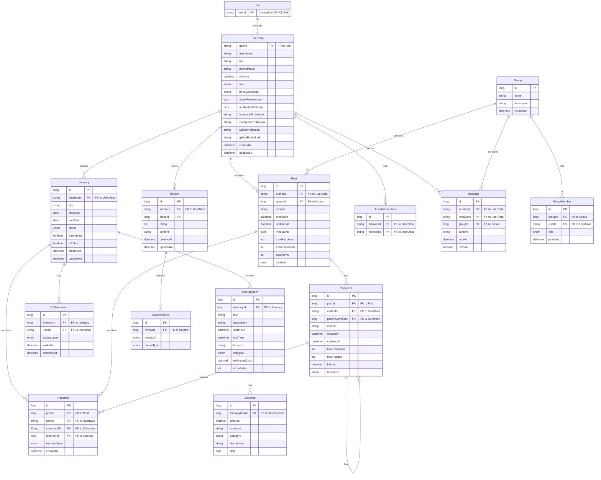
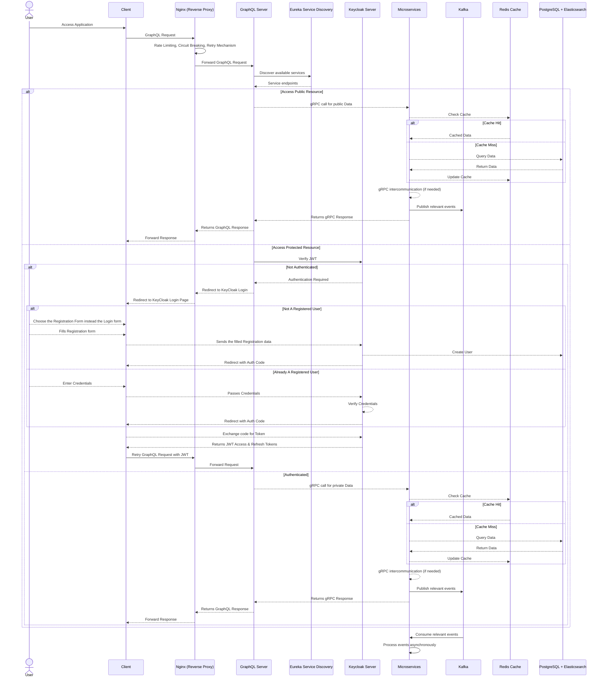

# Travel Platform Backend Engineering Specifications

## 1. Project Overview

The Travel Platform is a comprehensive system that combines travel itinerary planning with social media features. Key functionalities include:
- User will be able to:
    - Register using email and password or social logins (Google, Facebook, GitHub, etc.)
    - Log in securely using JWT-based authentication
    - Recover and reset passwords
    - View and edit profile information
    - Customize privacy settings for their profile
    - Create Itinerary with start date, end date, and trip title
    - Add and organize places to visit, activities, and accommodations
    - Set specific dates and times for each activity
    - Categorize activities (e.g., sightseeing, dining, shopping)
    - Track budget and categorize expenses
    - Save travel plans as templates for future use
    - Share itineraries with other users
    - Search for destinations, activities, dates, and other users
    - Filter search results by categories, ratings, price ranges, etc.
    - Use geolocation-based search for nearby attractions and activities
    - Receive personalized search results based on preferences and past trips
    - Invite friends or other users to collaborate on travel plans
    - Receive instant updates on changes to shared itineraries
    - Set different access levels for collaborators (view, edit, or comment)
    - View version history and track changes in collaborative itineraries
    - Find and follow other travelers with shared interests
    - View an activity feed of connections' activities
    - Post travel stories, photos, and reviews
    - Tag locations and itineraries in posts
    - Like, comment on, and share others' posts
    - Create and share travel vlogs
    - View an interactive travel map of visited locations and shared experiences
    - Send direct messages to other users
    - Create and participate in group chats
    - Use real-time chat for discussing and adjusting travel plans
    - Participate in in-chat polls and decision-making tools for group planning
    - Write and read reviews for visited places
    - Rate destinations on a scale of 1 to 5 stars
    - Sort reviews by date, rating, or relevance
    - Include photos and videos in reviews
    - View travel itineraries on an interactive map
    - Identify and categorize planned destinations and activities
    - View route maps for travel between destinations
    - Book flights, hotels, and activities through third-party integrations
    - Automatically add booking details to itineraries
    - Compare prices for flights, hotels, and activities
    - Upload and share photos from trips
    - Organize photos by trip and itinerary
    - Store and share important travel documents
    - Control access to shared files with privacy settings
    - Receive notifications about itinerary changes, social interactions, and booking confirmations
    - Generate reports summarizing travel activity and history
    - View personalized travel insights and statistics
    - Earn and share travel achievement badges and milestones
    - Earn badges and points for travel experiences and platform engagement
    - Compete on leaderboards with other users
    - Participate in travel challenges and quests during trips
    - Share travel stories and experiences on other social media platforms
    - Access travel-related information (weather forecasts, currency exchange rates, with thuird party apis)
    - Use the platform in multiple languages with localized content
- Moderator will be able to:
    - Review and moderate user posts, reviews, and comments
    - Handle content that violates community guidelines
    - Manage a queue of flagged content
- Admin will be able to:
    - View and manage user accounts
    - Assign different roles to users (regular user, moderator, admin)
    - Implement and manage user bans or restrictions
    - Oversee content moderation activities
    - Manage the platform's content guidelines
    - Handle escalated content issues
    - Access and manage the admin panel
    - Monitor platform usage and user engagement
    - Track key performance indicators (KPIs) for business health
    - Generate custom reports for stakeholders
    - Oversee security measures, including regular audits and penetration testing
    - Oversee internationalization and localization efforts
    - Manage and update the community-curated template library
    - Oversee the implementation of new features and integrations
    - Manage third-party integrations and APIs

The platform is designed to be highly scalable, starting with an initial load of 100,000 users but with the capability to handle significant growth.

## 2. Technology Stack

### Core Backend:
- **Language**: Java 
- **Framework**: Spring Boot
- **Build Tool**: Gradle - Kotlin
- **Client-Server API**: GraphQL (with spring-boot-starter-graphql)
- **Service-to-Service Communication**: gRPC (with grpc-spring-boot-starter)
- **Data Serialization**: Protobuf
- **Authentication & Authorization**: Keycloak
- **Real-Time Communication**: Socket.IO
- **Database**: PostgreSQL (primary datastore)
- **ORM**: Spring Data JPA
- **Caching**: Redis
- **Message Queue**: Apache Kafka
- **Search Engine**: Elasticsearch
- **Service Discovery**: Netflix Eureka
- **Reverse Proxy**: NGINX
- **Circuit Breaker**: Resilience4j
- **Configuration Management**: Spring Cloud Config
- **Documentation**: Swagger API
- **Development Environment**: A consistent development environment using Docker Compose

### DevOps & Monitoring:
- **Containerization**: Docker
- **Container Orchestration**: Kubernetes
- **Distributed Tracing**: Zipkin
- **CI/CD**: Jenkins
- **Monitoring**: Prometheus & Grafana
- **Logging**: ELK Stack (Elasticsearch, Logstash, Kibana)
- **Error Tracking**: Sentry

### Additional Tools:
- **Version Control**: Git
- **API Documentation**: GraphQL Playground, gRPC reflection
- **AWS S3**: For storing user-generated content
- **AWS CloudFront**: For faster content delivery
- **Feature Flags**: Togglz
- **API Versioning**: Custom header-based versioning or content negotiation
- **Distributed Transaction Management**: Saga pattern implementation

## 3. ER Diagram



## 4. UML  Diagram

```mermaid
classDiagram
    class User {
        -String userId
        -String email
        -String userName
        -String firstName
        -String lastName
        -DateTime createdAt
        -DateTime updatedAt
        -Boolean isActive
        -UserRole role
        -String profilePicUrl
        -String bio
        -enum status
        -PrivacySettings privacySettings
        -Json travelPreferences
        -Json notificationSettings
        -String facebookProfileLink
        -String instagramProfileLink
        -String twitterProfileLink
        -String githubProfileLink        
        +user(userId: Long!): User
        +updateUser(input: UpdateUserInput!): User
        +deleteUser(userId: Long!): Boolean
        +followUser(followerId: Long!, followedId: Long!): Boolean
        +unfollowUser(followerId: Long!, followedId: Long!): Boolean
        +getUserConnections(userId: Long!): [UserConnection]
    }

    class UserConnection {
            -Long userConnectionId
            -Long followerId
            -Long followedId
    }

    class Itinerary {
        -Long itineraryId
        -Long createdBy
        -String title
        -Date startDate
        -Date endDate
        -ItineraryStatus status
        -Boolean isTemplate
        -Boolean isPublic
        -DateTime createdAt
        -DateTime updatedAt
        +createItinerary(input: CreateItineraryInput!): Itinerary
        +updateItinerary(Long: Long!, input: UpdateItineraryInput!): Itinerary
        +deleteItinerary(Long: Long!): Boolean
        +shareItinerary(Long: Long!, userIds: [Long!]!): Boolean
        +cloneTemplate(Long: Long!): Itinerary
        +addItineraryItem(itineraryId: Long!, input: CreateItineraryItemInput!): ItineraryItem
        +updateItineraryItem(itineraryId: Long!, itemId: Long!, input: UpdateItineraryItemInput!): ItineraryItem
        +deleteItineraryItem(itineraryId: Long!, itemId: Long!): Boolean
        +reorderItineraryItems(itineraryId: Long!, itemIds: [Long!]!): [ItineraryItem]
        +addReaction(itineraryId: Long!, input: CreateReactionInput!): Reaction
        +updateReaction(itineraryId: Long!, userId: Long!, input: UpdateReactionInput!): Reaction
        +removeReaction(itineraryId: Long!, userId: Long!): Boolean
    }

    class ItineraryItem {
        -Long itineraryItemId
        -Long itineraryId
        -String title
        -String description
        -DateTime startTime
        -DateTime endTime
        -String location
        -ItemCategory category
        -Expense expense
        -BigDecimal estimatedCost
        -Int orderIndex
    }

    class Expense {
        -Long expenseId
        -Long itineraryItemId
        -BigDecimal amount
        -enum category
        -String currency
        -ExpenseCategory category
        -String description
        -Date date
        +addExpense(itemId: Long!, input: CreateExpenseInput!): Expense
        +updateExpense(Long: Long!, input: UpdateExpenseInput!): Expense
        +deleteExpense(Long: Long!): Boolean
        +getExpensesForItinerary(itineraryId: Long!): [Expense]
        +getExpensesSummary(itineraryId: Long!): ExpenseSummary
    }

    class Collaboration {
        -Long collaborationId
        -Long itineraryId
        -Long userId
        -enum accessLevel
        -DateTime invitedAt
        -DateTime acceptedAt
        +inviteCollaborator(itineraryId: Long!, userId: Long!, accessLevel: AccessLevel!): Collaboration
        +acceptInvitation(itineraryId: Long!, userId: Long!): Boolean
        +updateCollaboratorAccess(itineraryId: Long!, userId: Long!, accessLevel: AccessLevel!): Collaboration
        +removeCollaborator(itineraryId: Long!, userId: Long!): Boolean
        +getCollaborators(itineraryId: Long!): [Collaboration]
    }

    class Post {
        -Long postId
        -Long authorId
        -Long itineraryId
        -String content
        -DateTime createdAt
        -DateTime updatedAt
        -Json mediaUrls
        -Long groupId
        -Point location
        -Int totalReactions
        -Int totalComments
        -Int totalViews
        +createPost(input: CreatePostInput!): Post
        +updatePost(Long: Long!, input: UpdatePostInput!): Post
        +deletePost(Long: Long!): Boolean        
        +addComment(postId: Long!, input: CreateCommentInput!): Comment
        +addReaction(postId: Long!, input: CreateReactionInput!): Reaction
        +updateReaction(postId: Long!, userId: Long!, input: UpdateReactionInput!): Reaction
        +removeReaction(postId: Long!, userId: Long!): Boolean
    }

    class Comment {
        -Long commentId
        -Long postId
        -Long authorId
        -Long parentCommentId
        -String content
        -Int totalReactions
        -Int totalReplies
        -Boolean hidden
        -DateTime createdAt
        -DateTime updatedAt
        +replyToComment(postId: Long!, parentCommentId: Long!, input: CreateCommentReplyInput!): Comment
        +updateComment(commentId: Long!, input: UpdateCommentInput!): Comment
        +hideComment(commentId: Long!): Boolean
        +unhideComment(commentId: Long!): Boolean
        +deleteComment(commentId: Long!): Boolean
        +addReaction(commentId: Long!, input: CreateReactionInput!): Reaction
        +updateReaction(commentId: Long!, userId: Long!, input: UpdateReactionInput!): Reaction
        +removeReaction(commentId: Long!, userId: Long!): Boolean
    }

    class Reaction{
        -Long reactionId
        -Long postId 
        -Long reactedBy 
        -Long commentID
        -Long itineraryId 
        -enum reactionType 
        -DateTime createdAt
        -DateTime updatedAt
    }

    class Review {
        -Long reviewId
        -Long authorId
        -Long placeId
        -Int rating
        -String content
        -DateTime createdAt
        -DateTime updatedAt
        +createReview(input: CreateReviewInput!): Review
        +updateReview(Long: Long!, input: UpdateReviewInput!): Review
        +deleteReview(Long: Long!): Boolean
        +getReviewsForPlace(placeId: Long!): [Review]
        +addReviewMedia(reviewId: Long!, input: CreateReviewMediaInput!): ReviewMedia
        +removeReviewMedia(reviewId: Long!, mediaId: Long!): Boolean
    }

    class ReviewMedia {
        -Long reviewMediaId
        -Long reviewId
        -String mediaUrl
        -MediaType mediaType
    }

    class Group {
        -Long groupId
        -String name
        -String description
        -DateTime createdAt
        -DateTime updatedAt
        +createGroup(input: CreateGroupInput!): Group
        +updateGroup(Long: Long!, input: UpdateGroupInput!): Group
        +deleteGroup(Long: Long!): Boolean
        +joinGroup(groupId: Long!, userId: Long!): Boolean
        +leaveGroup(groupId: Long!, userId: Long!): Boolean
        +updateRole(groupId: Long!, userId: Long!, role: GroupRole!): Boolean
    }

    class GroupMember {
        -Long groupMemberId
        -Long groupId
        -Long userId
        -GroupRole role
        -DateTime joinedAt
    }

    class Message {
        -Long messageId
        -Long senderId
        -Long receiverId
        -Long groupId
        -String content
        -DateTime sentAt
        -Boolean isRead
        +sendMessage(input: SendMessageInput!): Message
        +markAsRead(Long: Long!): Boolean
        +getConversation(userId1: Long!, userId2: Long!): [Message]
        +getGroupMessages(groupId: Long!): [Message]
        +deleteMessage(Long: Long!): Boolean
    }

    class SearchService {
        +searchItineraries(criteria: SearchCriteria!): [Itinerary]
        +searchUsers(criteria: SearchCriteria!): [User]
        +searchPosts(criteria: SearchCriteria!): [Post]
        +searchPlaces(criteria: SearchCriteria!): [Place]
        +getPersonalizedResults(userId: Long!, criteria: SearchCriteria!): PersonalizedResults
    }

    class NotificationService {
        +sendNotification(userId: Long!, notification: NotificationInput!): Notification
        +getUnreadNotifications(userId: Long!): [Notification]
        +markNotificationAsRead(Long: Long!): Boolean
        +updateNotificationPreferences(userId: Long!, preferences: NotificationPreferencesInput!): NotificationPreferences
    }

    class RecommendationService {
        +getPersonalizedItineraries(userId: Long!): [Itinerary]
        +getPopularDestinations: [Destination]
        +getSimilarItineraries(itineraryId: Long!): [Itinerary]
        +getRecommendedUsers(userId: Long!): [User]
    }

    class BookingService {
        +bookFlight(input: FlightBookingInput!): FlightBooking
        +bookHotel(input: HotelBookingInput!): HotelBooking
        +bookActivity(input: ActivityBookingInput!): ActivityBooking
        +cancelBooking(Long: Long!): Boolean
        +getBookingDetails(Long: Long!): Booking
        +syncBookingWithItinerary(bookingId: Long!, itineraryId: Long!): Boolean
    }

    class PaymentService {
        +processPayment(input: PaymentInput!): Payment
        +refundPayment(Long: Long!): Boolean
        +getPaymentHistory(userId: Long!): [Payment]
        +updatePaymentMethod(userId: Long!, input: PaymentMethodInput!): PaymentMethod
    }

    class AnalyticsService {
        +trackUserBehavior(userId: Long!, event: BehaviorEventInput!): Boolean
        +generateUserInsights(userId: Long!): UserInsights
        +getPopularContent: PopularContent
        +getTravelTrends: TravelTrends
    }

    class FileService {
        +uploadFile(file: Upload!): File
        +getFile(Long: Long!): File
        +deleteFile(Long: Long!): Boolean
        +generatePresignedUrl(Long: Long!): String
    }

    class GamificationService {
        +awardPoints(userId: Long!, points: Int!): Boolean
        +createBadge(input: CreateBadgeInput!): Badge
        +awardBadge(userId: Long!, badgeId: Long!): Boolean
        +getLeaderboard: [LeaderboardEntry]
        +getUserAchievements(userId: Long!): [Achievement]
    }

    class IntegrationService {
        +syncWithExternalCalendar(userId: Long!, credentials: CalendarCredentialsInput!): Boolean
        +importContactsFromSocialMedia(userId: Long!, platform: SocialMediaPlatform!): [Contact]
        +shareToSocialMedia(userId: Long!, postId: Long!, platforms: [SocialMediaPlatform!]!): Boolean
    }

    class GeolocationService {
        +getNearbyPlaces(lat: Float!, lon: Float!, radius: Float!): [Place]
        +getDistance(point1: PointInput!, point2: PointInput!): Float
        +geocodeAddress(address: String!): Point
        +reverseGeocode(lat: Float!, lon: Float!): Address
    }

    class CurrencyService {
        +getExchangeRate(from: String!, to: String!): Float
        +convertCurrency(amount: Float!, from: String!, to: String!): Float
        +getSupportedCurrencies: [Currency]
    }

    User -- Itinerary : creates
    User -- UserConnection : has
    User -- Post : publishes
    User -- Review : writes
    User -- Message : sends
    User -- GroupMember : participates
    Itinerary -- ItineraryItem : contains
    Itinerary -- Collaboration : has
    ItineraryItem -- Expense : has
    Post -- Comment : has
    Post -- Reaction : receives
    Comment -- Comment : replies
    Review -- ReviewMedia : includes
    Group -- GroupMember : has
    Group -- Message : contains
    SearchService -- Itinerary : searches
    SearchService -- User : searches
    SearchService -- Post : searches
    RecommendationService -- Itinerary : recommends
    NotificationService -- User : notifies
    BookingService -- Itinerary : books for
    PaymentService -- User : processes payments for
    AnalyticsService -- User : analyzes
    FileService -- Post : manages files for
    FileService -- Review : manages files for
    GamificationService -- User : gamifies
    IntegrationService -- User : integrates external services for
    GeolocationService -- ItineraryItem : provides location data for
    CurrencyService -- Expense : converts currencies for
```



## 5. Services Implementations

Each microservice is implemented as a separate Spring Boot application, adhering to the following principles:

- Single Responsibility: Each service focuses on a specific domain or functionality
- Loose coupling: Each microservice should be independent and communicate with other services through APIs
- Autonomy: Services can be developed, deployed, and scaled independently
- Resilience: Implement circuit breakers and fallback mechanisms
- Data Isolation: Each service manages its own data store
- Data Consistency: Ensure data consistency between Microservices
- Asynchronous Communication: Use Kafka for event-driven interactions between services
- Versioning: For reducing the microservice drift, this results in minimizing the disruption to the existing clients using the services

### Key Services:

- User Service:
     - Manage user profiles
     - Handle user preferences and settings
     - Handle user-related operations (update profile, change settings, etc)
- Itinerary Service:
     - Create, edit, and manage travel itineraries
     - Handle itinerary items and expenses
     - Handle itinerary sharing and collaboration
     - Integrate with Booking Service for reservations
- Booking Service:
        - Integrates with third-party APIs for flight, hotel, and activity booking
        - Manage booking-related operations and confirmations
- Content Service:
     - Manage user posts and interactions
     - Implement activity feeds
     - Handle user connections(follow/unfollow)
- Reservation Service:
        - Manage booking processes
        - Handle reservation status and updates
- Search Service:
     - Manage advanced search functionality
     - Integrates with Elasticsearch for efficient searching
     - Manage personalized search results
     - Integrate with User and Itinerary services for data
- Recommendation Service:
     - Generate personalized travel recommendations (Without AI or LLMs Or ML)
     - Process user behavior data for improved suggestions
- Notification Service:
     - Handle various types of notifications (email, push, in-app)
     - Manage notification preferences and delivery
- File Services:
        - Manages upload, storage, and retrival of files
        - Integrate with AWS S# for storage
- Analytics Service:
     - Process user behavior data
     - Generate insights and reports
     - Support data-driven decision making
- Reviews and Ratings Service:
     - Handle the review and rating system
- Messaging Service:
        - Manages direct messages and group chats
        - Manage real-time chat functionality
        - Ensure all messages are encrypted for security purposes
- Gamification Service:
        - Manage user achievements and badges
        - Handle point systems and leaderboards
        - Create and manage challenges or quests
- Payment Service:
        - Handle financial transactions securely
        - Integrate with various payment gateways
        - Manage refunds and currency conversions
        - Store and retrieve payment history
- Integration Service:
        - Integrate with third-party travel APIs
        - Manage API credentials and rate limits
        - Handle data transformation between external APIs and internal services
- Geolocation Service:
        - Provide location-based features
        - Calculate distances and proximity
        - Integrate with mapping services
- Curreency Service:
        - Manages currency conversion for multi-currency supports
        - Integrates with external APIs for real-time exchange rates

_Implement service-level rate limiting for more granular control_

## 6. Application Control-Flow Overview



## 7. API Design

### GraphQL API

The system uses GraphQL for client-server communication, providing a flexible and efficient way for clients to request exactly the data they need.

#### Schema Design Principles:
- Define clear and descriptive types for each entity
- Use input types for mutations to ensure type safety
- Implement connections for paginated lists
- Utilize custom scalars for dates and other complex types
- Design nested resolvers for related data
- Implement API versioning for smoother updates and backward compatibility

### gRPC Services

gRPC is used for efficient service-to-service communication within the backend.

#### Service Definition Principles:
- Define clear and concise service methods
- Use protocol buffers (protobuf) for strong typing
- Implement streaming for real-time data where appropriate
- Design reusable message types

### API Versioning

The system uses a header-based versioning approach or content negotiation for a cleaner API structure:

- Use custom headers (e.g., `Accept-version: v1`) or content negotiation (e.g., `Accept: application/vnd.travelplatform.v1+json`) for versioning
- Maintain at least one previous version when introducing changes
- Document breaking changes and provide migration guides
- Use API gateways to route requests to appropriate service versions
- Implement feature toggles for gradual rollout of new API versions

## 8. Security Considerations

Security is a critical aspect of the system design:

- **Authentication & Authorization**:
   - Keycloak will serve as our centralized authentication and authorization server:
     - **Integration**:
       - Integrate Keycloak with our Spring Boot services using Spring Security OAuth2
       - Configure our _GraphQL Server_ to validate tokens with Keycloak
     - **User Management**: Centralized user registration, login, and profile management
     - **Identity Brokering**: Support authentication via social logins (Google, Github, Facebook, etc.)
     - **Multi-factor Authentication**: Implement additional security layers ***when needed!!!***
     - **Token Management**: Handle OAuth 2.0 token issuance, validation, and revocation
     - **Admin Console**: Utilize Keycloak's admin interface for IAM administration
- **Token-based Authentication**: Use JWT token for stateless authentication
- **Fine-grained Authorization**: Implement role-based and attribute-based access control (RBAC and ABAC)
- **Token Introspection**: Validate tokens in real-time using Keycloak's introspection endpoint
- **Token Management**:
  - Implement refresh token handling for improved security
  - Develop a token revocation strategy for compromised tokens
- **Data Encryption**: Encrypt sensitive data
- **Input Validation**: Validate all input data to prevent injection attacks
- **Secure Communication**: Use HTTPS for all client-server communication and mTLS for service-to-service communication

## 9. Scalability and Performance

The system is designed to be highly scalable and performant:

- **Horizontal Scaling**: All services can be scaled horizontally
- **Caching Strategy**: 
  - Implement a multi-level caching approach:
    - Application-level caching for frequently accessed, read-only data
    - Distributed caching with Redis for shared, frequently changing data
    - Database query result caching for expensive computations
- **Eventual Consistency**:
  - Implement strategies to handle eventual consistency in the distributed system
  - Use techniques like Conflict-free Replicated Data Types (CRDTs) or version vectors for conflict resolution
- **Database Scaling**: 
  - Implement read replicas and sharding for PostgreSQL
  - Implement database connection pooling for improved performance
- **Asynchronous Processing**: Use Kafka for handling high-volume data streams
- **Efficient Search**: Leverage Elasticsearch for fast, full-text search capabilities
- **Load Balancing**: Implement at the Reverse Proxy and service leve

## 10. Monitoring and Logging

Comprehensive monitoring and logging are crucial for maintaining system health and troubleshooting issues:

- **Metrics Collection**: Use Prometheus for collecting and storing metrics
- **Visualization**: Utilize Grafana for creating dashboards and visualizing metrics
- **Centralized Logging**: Implement the ELK stack (Elasticsearch, Logstash, Kibana) for log aggregation and analysis
- **Distributed Tracing**: 
   - Implement Zipkin for end-to-end distributed tracing
   - Use Spring Cloud Sleuth for integrating tracing into our Spring Boot applications
- **Alerting**: Set up alerts for critical metrics and log patterns
- **Health Checks**: Implement health check endpoints for all services
- **Log Correlation**: Implement correlation IDs to trace requests across multiple services
- **Error Tracking**: Use Sentry for real-time error tracking and debugging
- **Distributed Tracing**: 
- Implement Zipkin for end-to-end distributed tracing
- Integrate tracing with existing logging and metrics for comprehensive observability

## 11. Fault Tolerance and Disaster Recovery

To ensure system reliability:

- Implement circuit breakers (using Resilience4j) to prevent cascade failures
- Use retry mechanisms with exponential backoff for transient failures
- Implement bulkheads to isolate failures
- Set up automated failover for critical services
- Conduct regular disaster recovery drills
- Implement multi-region deployments for high availability
- Use chaos engineering practices to identify weaknesses

## 12. Performance Benchmarks

Initial performance targets:

- API response time: 97% of requests under 100ms
- Database query performance: 99% of queries under 50ms
- Message processing: Handle 1000 messages per second per Kafka partition
- Search latency: 98% of searches return results in under 100ms
- System uptime: 99.99% availability

Regularly review and adjust these benchmarks based on system growth and user needs.

## 13. Third-party Integrations

For managing external API integrations:

- Use circuit breakers to handle external API failures
- Implement retry mechanisms with exponential backoff
- Cache responses where appropriate to reduce external calls
- Set up monitoring for API quotas and rate limits
- Implement webhook receivers for real-time updates where available
- Use API management tools for documentation and monitoring
- Regularly review and update API integrations to ensure compatibility

## 14. Folder Structure

```
travel-platform/
│
├── diagrams/
│   ├── architecture-diagram.svg
│   ├── er-diagram.svg
│   ├── dataflow-diagram.svg
│   └── sequence-diagrams/
│       ├── create-itinerary.svg
│       └── booking-flow.svg
│       └── ...
│
├── services/
│   ├── config-server/
│   ├── discovery-service/
│   ├── api-gateway/
│   ├── user-service/
│   ├── itinerary-service/
│   ├── content-service/
│   ├── booking-service/
│   ├── search-service/
│   ├── recommendation-service/
│   ├── messaging-service/
│   ├── review-rating-service/
│   ├── notification-service/
│   ├── analytics-service/
│   └── gamification-service/
│
├── scripts/
│   ├── setup-dev-env.sh
│   ├── run-all-services.sh
│
├── docs/
│   ├── api/
│   ├── architecture/
│   └── development-guide.md
│
├── .gitignore
├── docker-compose.yml
└── README.md
```

**Important Note:** All sorts of testing will be managed by a separate backend testing and QA/SA team.