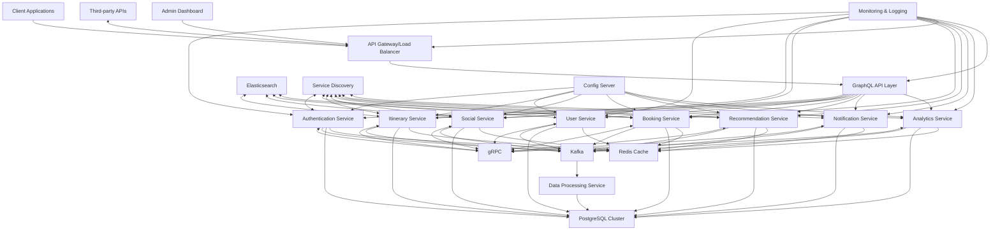

```mermaid
graph TD
    A[Client Applications] --> B[API Gateway/Load Balancer]
    B --> C[GraphQL API Layer]
    C --> D[Authentication Service]
    C --> E[User Service]
    C --> F[Itinerary Service]
    C --> G[Social Service]
    C --> H[Booking Service]
    C --> I[Recommendation Service]
    C --> J[Notification Service]
    C --> K[Analytics Service]
    D & E & F & G & H & I & J & K <--> L[gRPC]
    D & E & F & G & H & I & J & K --> M[Kafka]
    M --> N[Data Processing Service]
    D & E & F & G & H & I & J & K & N --> O[PostgreSQL Cluster]
    D & E & F & G & H & I & J & K --> P[Redis Cache]
    Q[Elasticsearch] <--> F & G & H & I
    R[Third-party APIs] <--> B
    S[Admin Dashboard] --> B
    T[Monitoring & Logging] --> D & E & F & G & H & I & J & K & B & C
    U[Service Discovery] <--> D & E & F & G & H & I & J & K
    V[Config Server] --> D & E & F & G & H & I & J & K
```
