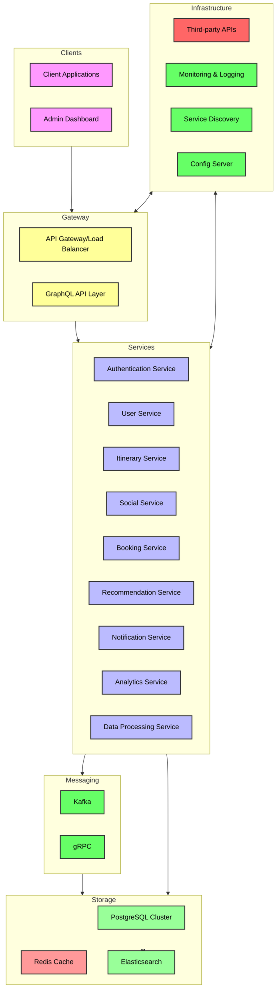
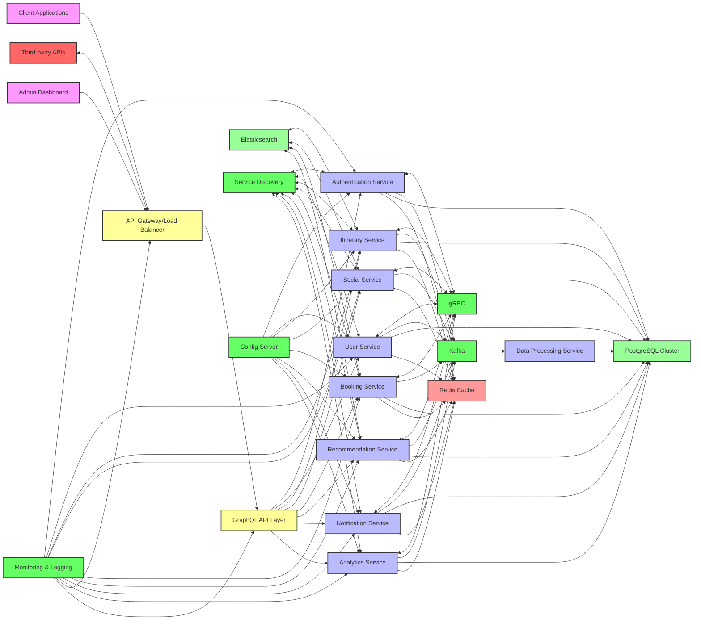

```mermaid
graph TD
    %% Define styles
    classDef client fill:#f9f,stroke:#333,stroke-width:2px,color:#000;
    classDef gateway fill:#ff9,stroke:#333,stroke-width:2px,color:#000;
    classDef service fill:#bbf,stroke:#333,stroke-width:2px,color:#000;
    classDef db fill:#9f9,stroke:#333,stroke-width:2px,color:#000;
    classDef cache fill:#f99,stroke:#333,stroke-width:2px,color:#000;
    classDef external fill:#f66,stroke:#333,stroke-width:2px,color:#000;
    classDef misc fill:#6f6,stroke:#333,stroke-width:2px,color:#000;

    %% Subgraphs for organization
    subgraph Clients
        A[Client Applications]:::client
        S[Admin Dashboard]:::client
    end

    subgraph Gateway
        B[API Gateway/Load Balancer]:::gateway
        C[GraphQL API Layer]:::gateway
    end

    subgraph Services
        D[Authentication Service]:::service
        E[User Service]:::service
        F[Itinerary Service]:::service
        G[Social Service]:::service
        H[Booking Service]:::service
        I[Recommendation Service]:::service
        J[Notification Service]:::service
        K[Analytics Service]:::service
        N[Data Processing Service]:::service
    end

    subgraph Messaging
        M[Kafka]:::misc
        L[gRPC]:::misc
    end

    subgraph Storage
        O[PostgreSQL Cluster]:::db
        P[Redis Cache]:::cache
        Q[Elasticsearch]:::db
    end

    subgraph Infrastructure
        R[Third-party APIs]:::external
        T[Monitoring & Logging]:::misc
        U[Service Discovery]:::misc
        V[Config Server]:::misc
    end

    %% Connections
    Clients --> Gateway
    Gateway --> Services
    Services --> Messaging
    Messaging --> Storage
    Services --> Storage
    Storage <--> Q
    Infrastructure <--> Gateway
    Infrastructure <--> Services
```

```mermaid
graph LR
    %% Define styles
    classDef client fill:#f9f,stroke:#333,stroke-width:2px;
    classDef gateway fill:#ff9,stroke:#333,stroke-width:2px;
    classDef service fill:#bbf,stroke:#333,stroke-width:2px;
    classDef db fill:#9f9,stroke:#333,stroke-width:2px;
    classDef cache fill:#f99,stroke:#333,stroke-width:2px;
    classDef external fill:#f66,stroke:#333,stroke-width:2px;
    classDef misc fill:#6f6,stroke:#333,stroke-width:2px;

    %% Nodes
    A[Client Applications]:::client
    B[API Gateway/Load Balancer]:::gateway
    C[GraphQL API Layer]:::gateway
    D[Authentication Service]:::service
    E[User Service]:::service
    F[Itinerary Service]:::service
    G[Social Service]:::service
    H[Booking Service]:::service
    I[Recommendation Service]:::service
    J[Notification Service]:::service
    K[Analytics Service]:::service
    L[gRPC]:::misc
    M[Kafka]:::misc
    N[Data Processing Service]:::service
    O[PostgreSQL Cluster]:::db
    P[Redis Cache]:::cache
    Q[Elasticsearch]:::db
    R[Third-party APIs]:::external
    S[Admin Dashboard]:::client
    T[Monitoring & Logging]:::misc
    U[Service Discovery]:::misc
    V[Config Server]:::misc

    %% Connections
    A --> B
    B --> C
    C --> D
    C --> E
    C --> F
    C --> G
    C --> H
    C --> I
    C --> J
    C --> K
    D & E & F & G & H & I & J & K <--> L
    D & E & F & G & H & I & J & K --> M
    M --> N
    D & E & F & G & H & I & J & K & N --> O
    D & E & F & G & H & I & J & K --> P
    Q <--> F
    Q <--> G
    Q <--> H
    Q <--> I
    R <--> B
    S --> B
    T --> D
    T --> E
    T --> F
    T --> G
    T --> H
    T --> I
    T --> J
    T --> K
    T --> B
    T --> C
    U <--> D
    U <--> E
    U <--> F
    U <--> G
    U <--> H
    U <--> I
    U <--> J
    U <--> K
    V --> D
    V --> E
    V --> F
    V --> G
    V --> H
    V --> I
    V --> J
    V --> K
```
