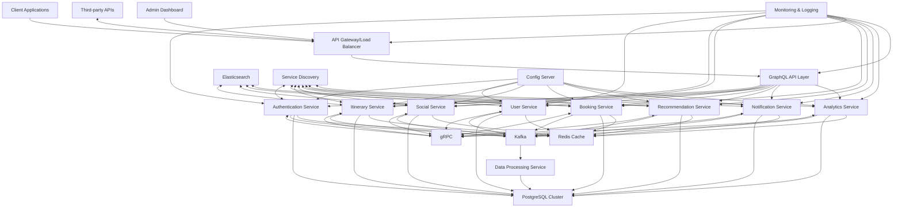
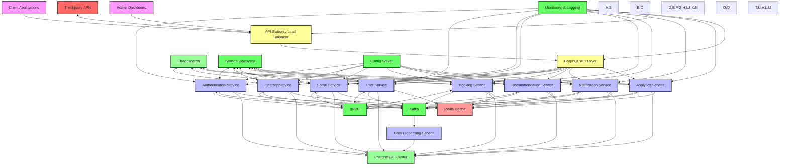

```mermaid
graph TD
    A[Client Applications] --> B[API Gateway/Load Balancer]
    B --> C[GraphQL API Layer]
    C --> D[Authentication Service]
    C --> E[User Service]
    C --> F[Itinerary Service]
    C --> G[Social Service]
    C --> H[Booking Service]
    C --> I[Recommendation Service]
    C --> J[Notification Service]
    C --> K[Analytics Service]
    D & E & F & G & H & I & J & K <--> L[gRPC]
    D & E & F & G & H & I & J & K --> M[Kafka]
    M --> N[Data Processing Service]
    D & E & F & G & H & I & J & K & N --> O[PostgreSQL Cluster]
    D & E & F & G & H & I & J & K --> P[Redis Cache]
    Q[Elasticsearch] <--> F & G & H & I
    R[Third-party APIs] <--> B
    S[Admin Dashboard] --> B
    T[Monitoring & Logging] --> D & E & F & G & H & I & J & K & B & C
    U[Service Discovery] <--> D & E & F & G & H & I & J & K
    V[Config Server] --> D & E & F & G & H & I & J & K
```

```mermaid
graph TD
    %% Nodes with styles
    A[Client Applications]
    B[API Gateway/Load Balancer]
    C[GraphQL API Layer]
    D[Authentication Service]
    E[User Service]
    F[Itinerary Service]
    G[Social Service]
    H[Booking Service]
    I[Recommendation Service]
    J[Notification Service]
    K[Analytics Service]
    L[gRPC]
    M[Kafka]
    N[Data Processing Service]
    O[PostgreSQL Cluster]
    P[Redis Cache]
    Q[Elasticsearch]
    R[Third-party APIs]
    S[Admin Dashboard]
    T[Monitoring & Logging]
    U[Service Discovery]
    V[Config Server]

    %% Connections
    A --> B
    B --> C
    C --> D
    C --> E
    C --> F
    C --> G
    C --> H
    C --> I
    C --> J
    C --> K
    D & E & F & G & H & I & J & K <--> L
    D & E & F & G & H & I & J & K --> M
    M --> N
    D & E & F & G & H & I & J & K & N --> O
    D & E & F & G & H & I & J & K --> P
    Q <--> F
    Q <--> G
    Q <--> H
    Q <--> I
    R <--> B
    S --> B
    T --> D
    T --> E
    T --> F
    T --> G
    T --> H
    T --> I
    T --> J
    T --> K
    T --> B
    T --> C
    U <--> D
    U <--> E
    U <--> F
    U <--> G
    U <--> H
    U <--> I
    U <--> J
    U <--> K
    V --> D
    V --> E
    V --> F
    V --> G
    V --> H
    V --> I
    V --> J
    V --> K

    %% Styling
    classDef client fill:#f9f,stroke:#333,stroke-width:2px;
    classDef gateway fill:#ff9,stroke:#333,stroke-width:2px;
    classDef service fill:#bbf,stroke:#333,stroke-width:2px;
    classDef db fill:#9f9,stroke:#333,stroke-width:2px;
    classDef cache fill:#f99,stroke:#333,stroke-width:2px;
    classDef external fill:#f66,stroke:#333,stroke-width:2px;
    classDef misc fill:#6f6,stroke:#333,stroke-width:2px;

    %% Apply styles
    A,S:::client
    B,C:::gateway
    D,E,F,G,H,I,J,K,N:::service
    O,Q:::db
    P:::cache
    R:::external
    T,U,V,L,M:::misc
```
