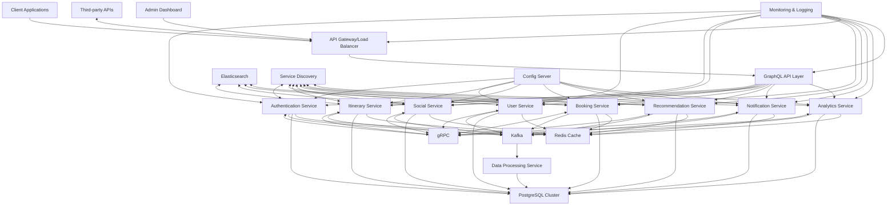
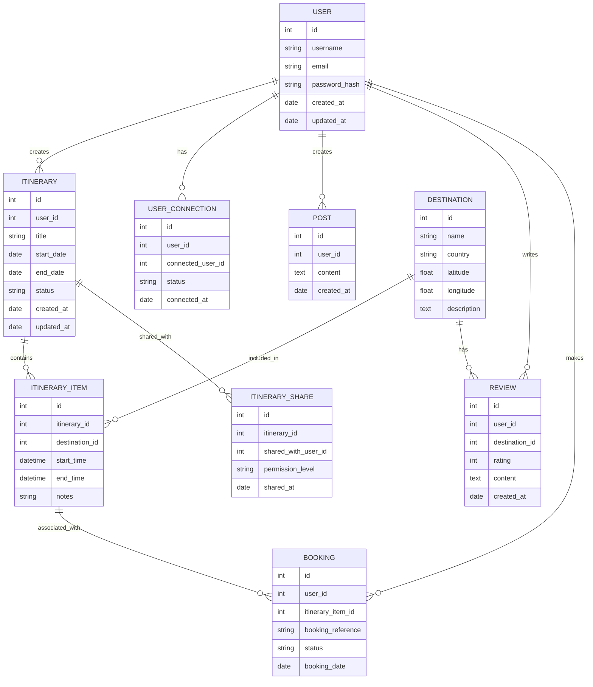
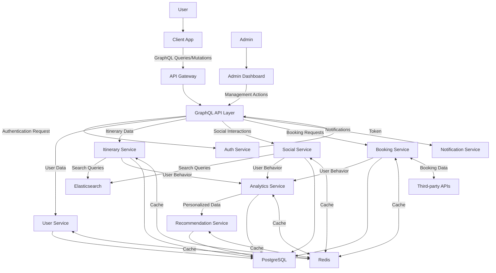

# Travel Platform Backend Engineering Specifications

## 1. Project Overview

The Travel Platform is a comprehensive system that combines travel itinerary planning with social media features. Key functionalities include:

- User authentication and profile management
- Itinerary creation, sharing, and collaboration
- Destination search and filtering
- Integration with third-party travel services for bookings
- Social features: user connections, experience sharing, messaging
- Personalized recommendations
- Review and rating system
- Photo and document sharing
- Gamification elements
- Trip analytics
- Budget tracking
- Travel buddy matching
- Interactive maps

The platform is designed to be highly scalable, starting with an initial load of 100,000 users but with the capability to handle significant growth.

## 2. System Architecture

The system follows a microservices architecture, leveraging Spring Boot for the core backend services. The architecture is designed for scalability, maintainability, and high performance.

### Key Components:

1. **Client Applications**: Web and mobile interfaces (managed by a separate frontend team)
2. **API Gateway**: Entry point for all client requests, handling routing and load balancing
3. **GraphQL API Layer**: Provides flexible data fetching for clients
4. **Microservices**:
   - Authentication Service
   - User Service
   - Itinerary Service
   - Social Service
   - Booking Service
   - Recommendation Service
   - Notification Service
   - Analytics Service
5. **Data Processing Service**: Handles batch processing tasks
6. **Databases**: 
   - PostgreSQL cluster for primary data storage
   - Redis for caching
   - Elasticsearch for efficient full-text search
7. **Message Queue**: Apache Kafka for asynchronous communication
8. **Service Discovery**: Netflix Eureka
9. **Configuration Management**: Spring Cloud Config
10. **Monitoring & Logging**: Prometheus, Grafana, and ELK Stack

### Architecture Diagram:

## 3. Technology Stack

### Core Backend:
- **Framework**: Java Spring Boot
- **Build Tool**: Gradle - Kotlin
- **Client-Server API**: GraphQL (with graphql-java and graphql-java-tools)
- **Service-to-Service Communication**: gRPC (with grpc-spring-boot-starter)
- **Authentication & Authorization**: Spring Security with:
   - JWT along with OAuth 2 and OpenID Connect
   - Keycloak for identity and access management
- **Real-Time Communication**: Socket.IO
- **Database**: PostgreSQL (primary datastore)
- **ORM**: Spring Data JPA
- **Caching**: Redis
- **Message Queue**: Apache Kafka
- **Search Engine**: Elasticsearch

### Microservices:
- **Service Discovery**: Netflix Eureka
- **API Gateway**: Spring Cloud Gateway (with GraphQL support)
- **Circuit Breaker**: Resilience4j
- **Configuration Management**: Spring Cloud Config
- **Distributed Tracing**: Zipkin

### DevOps & Monitoring:
- **Containerization**: Docker
- **Container Orchestration**: Kubernetes
- **CI/CD**: Jenkins
- **Monitoring**: Prometheus & Grafana
- **Logging**: ELK Stack (Elasticsearch, Logstash, Kibana)

### Additional Tools:
- **Version Control**: Git
- **API Documentation**: GraphQL Playground, gRPC reflection
- AWS S3 : For storing user-generated content
- AWS CloudFront : For faster content delivery

## 4. Data Model

The system's data model is designed to support all the required functionalities efficiently. Key entities include:

1. **User**: Stores user account information
2. **Itinerary**: Represents a user's travel plan
3. **ItineraryItem**: Individual items within an itinerary
4. **Destination**: Information about travel destinations
5. **UserConnection**: Represents connections between users
6. **Post**: User-generated content for sharing experiences
7. **Review**: User reviews for destinations
8. **Booking**: Travel service bookings associated with itinerary items
9. **ItineraryShare**: Tracks shared itineraries and permissions

### Entity-Relationship Diagram:

## 5. API Design

### GraphQL API

The system uses GraphQL for client-server communication, providing a flexible and efficient way for clients to request exactly the data they need.

#### Schema Design Principles:
- Define clear and descriptive types for each entity
- Use input types for mutations to ensure type safety
- Implement connections for paginated lists
- Utilize custom scalars for dates and other complex types
- Design nested resolvers for related data

#### Key Query Types:
- User profile and authentication
- Itinerary management
- Destination search and details
- Social interactions (posts, connections)
- Bookings and reservations
- Recommendations

#### Key Mutation Types:
- User registration and profile updates
- Itinerary creation and modification
- Social actions (create post, connect with user)
- Booking creation and management
- Reviews and ratings submission

### gRPC Services

gRPC is used for efficient service-to-service communication within the backend.

#### Service Definition Principles:
- Define clear and concise service methods
- Use protocol buffers (protobuf) for strong typing
- Implement streaming for real-time data where appropriate
- Design reusable message types

#### Key Service Definitions:
- UserService: User management and authentication
- ItineraryService: Itinerary CRUD operations
- SocialService: Handle social interactions
- BookingService: Manage travel bookings
- RecommendationService: Generate personalized recommendations
- NotificationService: Handle system notifications
- AnalyticsService: Process and retrieve analytics data

## 6. Service Implementations

Each microservice is implemented as a separate Spring Boot application, adhering to the following principles:

- Single Responsibility: Each service focuses on a specific domain or functionality
- Autonomy: Services can be developed, deployed, and scaled independently
- Resilience: Implement circuit breakers and fallback mechanisms
- Data Isolation: Each service manages its own data store
- Asynchronous Communication: Use Kafka for event-driven interactions between services

### Key Services:

1. **Authentication Service**:
   - Implement JWT-based authentication
   - Handle user registration and login
   - Integrate with Spring Security

2. **User Service**:
   - Manage user profiles
   - Handle user preferences and settings
   - Implement friend/connection management

3. **Itinerary Service**:
   - Create and manage travel itineraries
   - Handle itinerary sharing and collaboration
   - Integrate with Booking Service for reservations

4. **Social Service**:
   - Manage user posts and interactions
   - Handle messaging between users
   - Implement activity feeds

5. **Booking Service**:
   - Integrate with third-party travel APIs
   - Manage booking creation and status updates
   - Handle payment processing (if applicable)

6. **Recommendation Service**:
   - Generate personalized travel recommendations
   - Utilize machine learning algorithms for improved suggestions
   - Integrate with User and Itinerary services for data

7. **Notification Service**:
   - Handle various types of notifications (email, push, in-app)
   - Manage notification preferences and delivery

8. **Analytics Service**:
   - Process user behavior data
   - Generate insights and reports
   - Support data-driven decision making

## 7. Data Flow

The data flow in the system follows these general patterns:

1. Client requests come through the API Gateway
2. GraphQL API layer handles query/mutation resolution
3. GraphQL resolvers interact with appropriate microservices via gRPC
4. Microservices process requests, interacting with databases and caches
5. Asynchronous events are published to Kafka for inter-service communication
6. Data Processing Service consumes events for batch processing and analytics

### Data Flow Diagram:

## 8. Security Considerations

Security is a critical aspect of the system design:

- **Authentication & Authorization**:
   - Implement OAuth 2 and OpenID Connect protocols
   - Use Keycloak as the identity and Access Management (IAM) solution.
   - Support various grant types(Authorization Code, Client Credentials, Refresh Token, etc)
- **Single Sign-On (SSO)**: Leverage Keycloak's SSO capabilities across services
- **Token-based Authentication**: Use JWT token for stateless authentication
- **Fine-grained Authorization**: Implement role-based and attribbute-based access control (RBAC and ABAC)
- **Token Introspection** : Validate tokens in real-time usinnng Keycloak's introspection endpoint
- **Data Encryption**: Encrypt sensitive data at rest and in transit
- **API Security**: Implement rate limiting and request validation at the API Gateway
- **Input Validation**: Validate all input data to prevent injection attacks
- **Secure Communication**: Use HTTPS for all client-server communication and mTLS for service-to-service communication

## 9. Scalability and Performance

The system is designed to be highly scalable and performant:

- **Horizontal Scaling**: All services can be scaled horizontally
- **Caching Strategy**: Utilize Redis for caching frequently accessed data
- **Database Scaling**: Implement read replicas and sharding for PostgreSQL
- **Asynchronous Processing**: Use Kafka for handling high-volume data streams
- **Efficient Search**: Leverage Elasticsearch for fast, full-text search capabilities
- **Load Balancing**: Implement at the API Gateway and service level
- **Content Delivery Network (CDN)**: Use for static assets and cached content
- **Performance Monitoring**: Continuously monitor and optimize system performance

## 10. Monitoring and Logging

Comprehensive monitoring and logging are crucial for maintaining system health and troubleshooting issues:

- **Metrics Collection**: Use Prometheus for collecting and storing metrics
- **Visualization**: Utilize Grafana for creating dashboards and visualizing metrics
- **Centralized Logging**: Implement the ELK stack (Elasticsearch, Logstash, Kibana) for log aggregation and analysis
- **Distributed Tracing**: 
   - Implement Zipkin for end-to-end distributed tracing
   - Use Spring Cloud Sleuth for integrating tracing into our Spring Boot application
- **Alerting**: Set up alerts for critical metrics and log patterns
- **Health Checks**: Implement health check endpoints for all services

## 11. Development Workflow

To ensure code quality and maintainability:

- **Version Control**: Use Git with a branching strategy (e.g., GitFlow)
- **Code Review**: Implement mandatory code reviews for all changes
- **Continuous Integration**: Set up CI pipelines with Jenkins or GitLab CI
- **Automated Testing**: Implement unit, integration, and end-to-end tests
- **Code Quality Tools**: Use SonarQube for static code analysis
- **Documentation**: Maintain up-to-date API documentation and developer guides
- **Environment Parity**: Ensure development, staging, and production environments are as similar as possible

## 12. Deployment Strategy

The deployment strategy focuses on reliability, scalability, and ease of updates:

- **Containerization**: Package each service as a Docker container
- **Orchestration**: Use Kubernetes for container orchestration
- **Blue-Green Deployments**: Implement for zero-downtime updates
- **Canary Releases**: Gradually roll out new versions to a subset of users
- **Infrastructure as Code**: Use tools like Terraform for managing infrastructure
- **Configuration Management**: Externalize configurations using Spring Cloud Config
- **Disaster Recovery**: Implement regular backups and disaster recovery procedures
- **Multi-Region Deployment**: Consider deploying to multiple geographic regions for improved reliability and performance

## 13. Authentication and Authorization with Keycloak

Keycloak will serve as our centralized authentication and authorization server:

- **User Management**: Centralized user registration, login, and profile management
- **Identity Brokering**: Support authentication via social logins (Google, Facebook, etc.)
- **Multi-factor Authentication**: Implement additional security layers when needed
- **Token Management**: Handle OAuth 2.0 token issuance, validation, and revocation
- **Client Registration**: Manage client applications accessing our APIs
- **Admin Console**: Utilize Keycloak's admin interface for IAM administration
- **Theme Customization**: Customize login pages and emails to match our brand
- **Integration**: 
  - Integrate Keycloak with our Spring Boot services using Spring Security OAuth2
  - Configure our API Gateway to validate tokens with Keycloak

## 14. Distributed Tracing with Zipkin

Zipkin will provide insights into the behavior of our microservices:

- **Trace Collection**: Collect timing data for each microservice interaction
- **Visualization**: Use Zipkin's UI to view and analyze traces
- **Performance Analysis**: Identify bottlenecks and latency issues across services
- **Error Tracking**: Trace error propagation through the system
- **Integration**: 
  - Use Spring Cloud Sleuth to automatically instrument our Spring Boot applications
  - Configure our services to send trace data to Zipkin
- **Sampling**: Implement intelligent sampling strategies to manage high traffic volumes
- **Storage**: Configure appropriate storage backend for Zipkin (e.g., Elasticsearch)
- **Alerting**: Set up alerts based on trace data (e.g., for high latency or error rates)

## 15. Folder Structure

```mermaid
graph TD
    A["travel-platform"]
    
    A --> B["diagrams"]
    B --> B1["architecture-diagram.svg"]
    B --> B2["er-diagram.svg"]
    B --> B3["dataflow-diagram.svg"]
    B --> B4["sequence-diagrams"]
    B4 --> B4a["create-itinerary.svg"]
    B4 --> B4b["booking-flow.svg"]
    
    A --> C["services"]
    C --> C1["config-server"]
    C1 --> C1a["src"]
    C1 --> C1b["build.gradle"]
    C1 --> C1c["Dockerfile"]
    
    C --> C2["discovery-service"]
    C2 --> C2a["src"]
    C2 --> C2b["build.gradle"]
    C2 --> C2c["Dockerfile"]
    
    C --> C3["api-gateway"]
    C3 --> C3a["src"]
    C3 --> C3b["build.gradle"]
    C3 --> C3c["Dockerfile"]
    
    C --> C4["auth-service"]
    C4 --> C4a["src"]
    C4 --> C4b["build.gradle"]
    C4 --> C4c["Dockerfile"]
    
    C --> C5["user-service"]
    C5 --> C5a["src"]
    C5 --> C5b["build.gradle"]
    C5 --> C5c["Dockerfile"]
    
    C --> C6["itinerary-service"]
    C6 --> C6a["src"]
    C6 --> C6b["build.gradle"]
    C6 --> C6c["Dockerfile"]
    
    C --> C7["social-service"]
    C7 --> C7a["src"]
    C7 --> C7b["build.gradle"]
    C7 --> C7c["Dockerfile"]
    
    C --> C8["booking-service"]
    C8 --> C8a["src"]
    C8 --> C8b["build.gradle"]
    C8 --> C8c["Dockerfile"]
    
    C --> C9["recommendation-service"]
    C9 --> C9a["src"]
    C9 --> C9b["build.gradle"]
    C9 --> C9c["Dockerfile"]
    
    C --> C10["notification-service"]
    C10 --> C10a["src"]
    C10 --> C10b["build.gradle"]
    C10 --> C10c["Dockerfile"]
    
    C --> C11["analytics-service"]
    C11 --> C11a["src"]
    C11 --> C11b["build.gradle"]
    C11 --> C11c["Dockerfile"]
    
    A --> D["shared"]
    D --> D1["models"]
    D --> D2["utils"]
    D --> D3["constants"]
    
    A --> E["proto"]
    E --> E1["user.proto"]
    E --> E2["itinerary.proto"]
    E --> E3["booking.proto"]
    E --> E4["..."]
    
    A --> F["scripts"]
    F --> F1["setup-dev-env.sh"]
    F --> F2["run-all-services.sh"]
    F --> F3["generate-proto.sh"]
    
    A --> G["docs"]
    G --> G1["api"]
    G --> G2["architecture"]
    G --> G3["development-guide.md"]
    
    A --> H[".github"]
    H --> H1["workflows"]
    H1 --> H1a["ci.yml"]
    H1 --> H1b["cd.yml"]
    
    A --> I[".gitignore"]
    A --> J["docker-compose.yml"]
    A --> K["README.md"]
```

**Important Note :** All sorts of testing will be managed by separate backend testing, and QA/SA team.
